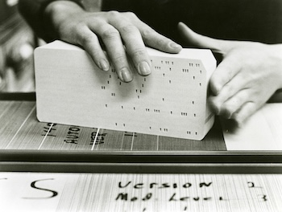

### Introduction
The past 60 years of software engineering has focused a lot of its attention towards building greater levels of abstraction between the computer and the computer programmer. The earliest digital computers were programmed on punch cards where each hole in the card represented a specific binary digit. 

Over time the industry developed compilers that could take programming langauges like Fortran, that happened to be closer to natural human language, and break them down into binary on our behalf. Many of these earliest languages were vastly easier to work with than machine code, but still required engineers to manage system level details like memory on their own. The 1990's brought with it newer languages with their own garbage collectors and runtime interpreters which automated away many of the remaining low level implementation details previous generations of developers had to contend with. This, for the most part, is a good thing. Most of the business problems software developers are asked to tackle do not require any knowledge or binary; and abstracting away these difficult, low level implementation details reduces development costs significantly which in a world constantly hungry for more and more software, is a good thing. 

But there are still lots of times when understanding binary for bitwise operations is extremely helpful for low level systems programming tasks. A comprehension of how computers represent all data and instructions in specific binary formats can be a superpower for engineers tasked with micro optimizations on tasks that need it. To that end, I have recently been reading ***C and C++ Under the Hood*** by *Anthony Dos Reis* and thought I would summarize the general takeaways from the introductory chapter on binary and hex values. 

### Binary Values
Digital computers work using binary. 1 for the presence of a signal and 0 for the absence of a signal. Usually a signal is represented by the existence of electrical flow through a wire or not, but this is not necessarily the case. The binary numbering system is a base 2 numbering system, since there are only two possible values used to represent all other values (1 and 0). This is in contrast to our regular base 10 numbering system which uses numbers 0 through 9 to represent all possible numbers. Both numbering systems increment their values by their respective bases from right to left. For base 10, the number
$$
542
$$
Gets computer like so
$$
(5 * 100) + (4 * 10) + (2 * 1)
$$
The first number on the right is in the ones place, the next number is 1 * 10 (since this is base 10), the third number is 10 * 10, and so on. 

Binary works exactly the same, just in base 2. The number 9 can be presented in binary like so
$$
1001
$$
Similar to what we did in base 10 above, each we can compute the value from right to left
$$
(1 * 1) + (0 * 2) + (0 * 4) + (1 * 8)
$$
The first number on the right is in the ones place, the next number will be multiplied by 2 (since this is base 2), the third number will be multipled by 4, the fourth number will be multiplied by 8. If we continued, the next numbers to the left would be multiplied by 16, 32, 64, etc. 

Most computer architectures group 8 bits together into discrete types called a byte. One byte can represent a positive whole number in the range of 0 to 255 (since 255 would be all 8 bits being 1). In order to increase the range of numbers we can represent on a computer, we group together multiple bytes to represent our data. Most implementations of an int in C++ use 4 bytes to represent an integer which allows for representing a number between 0 and 4,294,967,295. 

An interesting aspect of this, usable for bitwise operations, is that adding a zero to the right of any binary number will double the number. In this example, 4 becomes 8
$$
100 -> 4
1000 -> 8
$$
### Adding Binary Values
Adding two binary numbers is also very similar to adding base 10 numbers
$$
157 + 238 = 395
$$
Here we take any decimal other than than the first and we carry it over into the next column for addition. The same happens for binary
$$
0011 + 0011 = 0110
$$
Adding 1 + 1 will equal 10 (2 in binary), we then carry the 1 to the next column where we add 1 + 1 + 1 which equals 11 (3 in binary), we again carry the 1.

### Signed Integers
Of course, sometimes we want to represent negative numbers as well. When a number can be either positive or negative, we refer to this as a signed number with the left-most bit used to represent if the entire value is negative or positive. For a signed value, a 1 for the left-most bit means the value is negative and a 0 to represent the value is non-negative. 
$$
0011 -> +3
1011 -> -3
$$
The range of values a signed number of a certain bit width remains the same, but the need to represent negative numbers means the number of positive values a signed value can represent is cut in half. Whereas an unsigned 8 bit number can represent numbers 0 to 255, a signed number will represent values -128 to 127. 

### Overflows
When a number becomes larger than the number of bits the program has allocated to represent it, this is known as an overflow. For an 8 bit unsigned value, 255 is represented as: 11111111. But if we add one to this binary value:

$$
11111111 + 00000001 = 1 00000000
$$

We end up with 8 zeros and a one carried over to the a decimal place we do not have. In C/C++, this kind of overflow is known as undefined behavior and we cannot know for certain what the outcome will be. Ideally, the best result is probably that the program terminates with a fatal error. Other programming languages like Rust will safely wrap this operation and the user will end up back at zero. Still not ideal, but at least predictable. 

### Extensions
Larger values (more bytes) are less prone to overflows. Suppose we want to take a 1-byte binary number and extend it to two-bytes. We can do this in two ways. We can add on the left eight zeros or add on the left eight copies of the sign bit. For example, to extend 11111111, we can add eight zeros to get

0000000011111111

or we can replicate the sign bit to get

1111111111111111

The former is called *zero extension*, the latter is called *sign extension*. If a negative signed number is zero extended, it changes its value. For example, 11111111 (which is equal to -1) zero extended to 16 bits is 0000000011111111 (which is +255). If however, it is sign extended, its value remains -1. Therefore, we should always sign extend signed numbers. The inverse is true for unsigned values which should always be zero extended to keep its value. 

### Floating Points
Floating point values store non-whole numbers such as 13.25 and are usually represented as either 32-bit, 64-bit, or 128-bit binary values. Floating points are represented by dividing the binary representation into three parts: the sign bit, the exponent, and the significand. This is how the number 5.75 would be represented:

Step 1:
    5 in binary is 101.
    0.75 in binary is .11 (since 0.75 = 0.5 + 0.25 = 2⁻¹ + 2⁻²).
    So, 5.75 in binary = 101.11.
Step 2:
    We write 101.11 in normalized scientific notation: 1.0111 × 2².
    Here, 1.0111 is the significand, and 2 is the exponent.    
Step 3:
    Since 5.75 is positive, the sign bit = 0.
Step 4: 
    The bias for single-precision (8-bit exponent) is 127.
    Actual exponent = 2, so biased exponent = 2 + 127 = 129.
    129 in binary = 10000001.
Step 5:
    We drop the leading 1 (since it's implicit) and keep the next 23 bits: 01110000000000000000000.
Final Result:
    Sign bit: 0
    Exponent: 10000001
    Signigicand: 01110000000000000000000
    So, 5.75 in (32-bit) binary = 0 10000001 01110000000000000000000

Floating point value representations in binary are definitely far less trivial than whole number representations. This can contribute to significantly more compute to process these values than whole numbers and should be avoided unless necessary. 

One interesting fact worth noting here is that in mathematics, the addition of real numbers is associative, but the additional of floating points numbers by a computer is not. The order matters and requires careful attention by engineers in order to prevent unexpected behavior from creeping into their programs. 

### Hexadecimal
Because binary values can be difficult to read, short hand notations called hexidecimals exist. A hexadecimal is a base-16 numbering system using values 0-9 and a,b,c,d,e, and f. Besides the obvious values the numbers represent, the alphabetic values represent 10,11,,12,13,14, and 15 respectively. The hexadecimal value 2c5 would be translated like so

Weights be decimal

2 = 256   c = 16   5 = 1
$$
(2 x 256) + (12 x 16) + (5 x 1) = 709
$$

When parsing through disassembly and many debuggers, certain values such as memory addresses will commonly be represented as hexadecimal values to help with readability. A basic understanding of this numbering system will be helpful. 

### Conclusion
This is an extremely condensed summary of binary. To bring this full circle, software engineers rarely need to know or think about the binary ecosystem they work in. We have build abstractions on top of binary to make things easier and empower developers to be more productive. But for systems that need to operate at a lower level, or need to squeeze every possible optimization out of their software to be effective, an understanding of binary opens up a whole world of bitwise operations that can turbo-charge applications if properly leveraged. Even for those who do not need the optimizations bitwise operators allow for, understanding value overflows, signed and unsigned values, and having a rudimentary ability to read hexadecimal will almost certainly come in handy at some point in all of our careers. 
