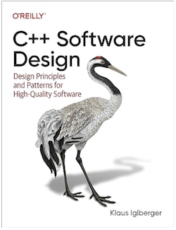

### Design for Change

Building software that does its designed task is often only half the battle. It is also the case that we need our software to adjust and be adaptable over time as requirements and needs change. One of the essential needs of good software is the ability to change it easily. Good software design is crucial to making adaptable software possible. Often with bad design patterns even the most simple change can turn into a complicated endevour as seemingy unrelated functionality breaks from your "minor change". 

Our major culprit to preventing flexible and robust software is dependencies. The coupling of different segments of code in order to form features and functionality. The interaction between code segments that we describe as dependency is a required part of writing software. But we have flexibility in how this is done, and choosing the right approach to managing dependencies goes a long way towards building better software systems.

### SOLID

SOLID is a mnemonic acronym for five software design patterns intended to make your software more understandable, flexible, and maintainable. Most of what I will be detailing below comes from

***C++ Software Design***

**Author:** *Klaus Iglberger*



I highly recommend the book, you can find it for purchase [here](https://www.amazon.com/Software-Design-Principles-Patterns-High-Quality/dp/1098113160/ref=sr_1_3?crid=3EIAKRJ6I9RYZ&dib=eyJ2IjoiMSJ9.leTWyGrelAfYNVsZmlqjNIIWuByFnaRuHn0QbI4jC74JFVAJM4QMV1IHHuxfxSJolTytjLL7EIgzeoxgr6DwgXcD7bDvgz7VWzkXdk2iHAzjXEMDPDzABa59mDvIZocmPwIH2uHwFCGB-sza3M1Kf5F1AwCK6t5g_p34kZsdQ7DDNocCgBKqsGQP4Sp2COFMATzuHyLjjznLijhGbNDfUipO2okLHYt_QO84nDIFnf0.ZEvP6-KyR-IGuLWK11zPIbzh_y0d6uYiCDaOwE4Gais&dib_tag=se&keywords=c%2B%2B+software+design&qid=1711117286&sprefix=c%2B%2B+softwar%2Caps%2C100&sr=8-3)

The acronym stands for

1) Single-responsibility principle
2) Open-close principle
3) Liskov substitution principle
4) Interface segregation principle
5) Dependency inversion principle

### Single-responsibility principle

One of the best strategies for reducing the types of artificial dependencies and allowing for a simplification of code change is breaking down systems into small, understandable pieces. The first part of the *SOLID* principle directly ties in to the separation of concerns: *Single-Responsibility Principle* (SRP). 

The *SRP* in its colloquial form says "Everything should just do one thing". What this exactly means is certianly up for interpretation. But I found the example used on pg. 12 to be an extremely helpful concrete example. Consider this Document class
```C++
class Document {
  public:
    virtual ~Document() = default;
    virtual void exportToJSON(/*...*/) const = 0;
    virtual void serialize(ByteStream&, /*...*/) = 0;
}
```
This purely abstract class looks eerily similar to classes I have personally written many times. On its surface there are a lot of things to like about it. This is a form of runtime polymorphism that allows our code to generically handle lots of different types without needing to know the nitty gritty details of how they implement their functionalities. Our document class appears to be well built to encapsulate and abstract away implementation details that other parts of code do not need to know. 

But this class is a bad design because it contains multiple artificial dependencies. First, exportTOJSON() needs to be implemented by all derived classes (even if the derived class does not support exporting to JSON!). Often in C++, things like implementing JSON exports is left to a third party library. If that is the case, all derived classes will be seperately using this library. If the time comes where a change is made to which library is used, we now need to go into each derived class and make the change (each derived class is coupled to each other in that all of them need the same change based on a change to a library). 

Another dependency is introduced in the serialize() function which will likely need to know which kind of document it needs to serialize its contents into. A common approach is to build a document type enum that each derived class uses to help understand its own state and how it should proceed with serialization. 
```C++
enum class DocumentType {
  pdf,
  word,
  // .... potentially many more types
}
```
But now anytime a new type is added, all other derived types will be directly affected since each derived type would "know" about all other types. How do we fix this? Well by ensuring the document class only does one thing, which is to represent the most basic operations of a document. 
```C++
class Document {
  public:
    virtual ~Document() = default;
}
```
Obviously we have now lost two important features we need. We will later discuss in the Interface Segregation Principle section how to better support exporting to JSON and serialization for this document class. 

### Open-close principle

Another part of *SOLID* is the *Open-Closed Principle* (OCP). This principle states that classes should be open to extension, but closed to modification. Consider the case where you build a class to complete its single responsibility. You test the class and you ship it off to the client. But now you need to add new functionality by adding another interface. Updating the class itself means we need to re-test and ship this same class out again with the changes. Furthermore, whenever a base class needs to be changed, there can be numerous implications for the derived classes. Therefore we should instead require that classes be extended when change is required. But this extension should be easy and should not modify existing code.

Consider the example of a product class. We need to be able to filter by different criterion including color and size. A poor design pattern would be to build another class called ProductFilter with interfaces for filtering by these criteria. The reason being that over time what we need to filter for will likely change, meaning we will need to change the ProductFilter class. Instead check out the example below where we build a BetterFilter class that can be extended using different templates. 

```C++

enum class Color {red, green, blue};
enum class Size { small, medium, large};

class Product {
  public:
  string name;
  Color color;
  Size size;
}

template <typename T> 
class Specification {
  public:
  virtual bool is_satisfied(T* item) = 0;
}

template <typename T>
class Filter {
  public:
  virtual Vector<T*> filter(vector<T*> items, Specification<T>& spec) = 0;
}

class BetterFilter: Filter<Product> {
  public:
  Vector<Product *> filter(vector<Product*> items, Specification<Product>&spec) override {
    vector<Product*> result;
    for (auto& item: items) {
      if (spec.is_satisfied(item)) {
        result.push_back(item);
      }
    }
    return result;
  }
}

class SizeSpecification : Specification<Product> {
  public:
  Size size;
  SizeSpecification(const Size size) : size{size} {}

  bool is_satisfied(Product* item) override {
    return item->size == size;
  }
}

class ColorSpecification: Specification<Product> {
  public:
  Color color;
  ColorSpecification(Color color) : color(color) {}

  bool is_satisfied(Product *item) override {
    return item->color == color;
  }
}

int main() {

  Product apple{"Apple", color::green, Size::small};
  Product tree{"Tree", Color::green, Size::large};
  Product house{"House", Color::blue, Size::large};

  BetterFilter bf;
  ColorSpecification green(Color::green);
  for (auto& item : bf.filter(items, green)) {
    std::cout<< item->name << " is green";
  }

  SizeSpecification large(Size::large);
  for (auto& item : bf.filter(items, large)) {
    std::cout<< item->name << " is large";
  }
}
```
When a new filter type is needed, we can build it out without ever needing to change the BetterFilter class.

### Liskov Substitution Principle

The Liskob Substitution principle is concerned with behavioral subtyping i.e. with the expected behavior of an abstraction. When subtyping a base class into its derived classes it is important that the *expectations* of the abstraction be adhered to. Consider the classic example of a Rectangle base class and a derived Square class

```C++
class Rectangle {
  public:
  virtual ~Rectangle() = default;

  int getWidth() const;
  int getHeight() const;

  virtual void setWidth(int);
  virtual void setHeight(int);

  virtual int getArea() const;

  private:
  int width;
  int height;
}

class Square: public Rectangle {
  public:
  void setWidth(int) override;
  void setHeight(int) override;

  int getArea() const override;
}
```
From a mathematical standpoint, having a square inherit from a rectangle makes sense. But consider this problem. When computing the getArea() function, we expect the width to be multiplied by the height. If we set the height to 7 and the width to 4, we expect getArea() = 24. But this will not be the case for the Square class which must have an equal width and height. For the square class, setting the height and width separately makes no sense. When dealing with abstractions of this type, we may well have a function like this:

```C++
void transform(Rectangle &rectanle) {
  rectangle.setWidth(7);
  rectangle.setHeight(4);
}
```
Our expectaion is this rectangle has a height of 4 and a width of 7. But if the actual derived class is a square, this is not the case and unexpected results may occur. 

It is important that our derived classes can always be subsituted for a based class without any issues or violation of our expectations. 

### Interface Segregation Principle

The I in *SOLID* stands for *Interface Segregation Principle* (ISP). Simply put, it means clients should not be forced to depend on methods that they do not use. In our document example used above, I mentioned that some derived classes may be force to implement methods they do not need or support. The ISP recommends decoupling interfaces by instead seperating the interfaces like so
```C++
class JSONExportable {
  public:
    virtual ~JSONExportable = default;
    virtual void exportToJSON(/*...*/) const = 0;
};
class Serializable {
  public:
    virtual ~Serializable() = default;
    virtual void serialize(ByteStream& bs, /*...*/) const = 0;
};
class Document: public JSONExportable, public Serializable {
  public:
    virtual ~Document() = default;
}
```
When structured this way, we can now minimize dependencies to only the set of functions that is actually required
```C++
void exportDocument(JSONExportable const& exportable) {
  exportable.exportToJSON(/*pass arguments*/);
}
```
Now the JSONExportable functionality no longer depends on the serialization functionality or the ByteStream class. 

### Dependency Inversion Principle

The *Dependency Inversion Principle* simples states that for the sake of dependencies, you should depend on abstractions instead of concrete types or implementation details. This principle can be broken down into two rules:

1) High-level modules (code that is stable, with low dependency), should not depend on low-level modules (malleable, volitile, high dependency). Both should depend on abstractions. 
2) Abstractions should not depend on details. Instead details should depend on abstractions. 

Consider this example that has a high level and low level module. 
```C++
enum class Relationship {
  parent, 
  child, 
  sibling
};

class Person {
  public:
  string name;
};

// low-level
class Relationships {
  vector<tuple<Person, Relationship, Person>> relations;

  void add_parent_and_child({const Person& parent, const Person& child}) {
    relations.push_back({parent, Relationship::parent, child});
    relations.push_back({child, Relationship::child, parent});
  }
};

// High-level
class Research {
  public:
  Research(Relationships& relationships) {
    auto& relations = relationships.relations;
    for (auto&& [first, rel, second] : relations) {
      if (first.name == "John" && rel == Relationship::parent) {
        std::cout<< "John has a child called " << second.name << std::endl;
      }
    }
  }
};

int main() {
  Person parent{"John"};
  Person child1{"Chris"}, child2{"Matt"};

  Relationships relationships;
  relationships.add_parent_and_child(parent, child1);
  relationships.add_parent_and_child(parent, child2);

  Research _(relationships);
  return 0;
}
```

Here we have a high level module recieving a low level module as a dependency. The research class is aware of the Relationships class and implements its part using the vector within the Relationships class. But since Relationships is low-level, it is subject to change. Perhaps it stops using a vector or moves that vector to be private. Both changes will brake our high level code. 

To fix this, we need to introduce another abstraction. In this example I create the RelationshipBrowser class (a pure virtual class) which will act as our abstraction that mediates and removes the dependency of our high level code on our low level implementation details. 

```C++ 
class RelationshipBrowser {
  public:
  virtual vector<Person> final_all_children_od(const string& name) = 0;
}

enum class Relationship {
  parent, 
  child, 
  sibling
};

class Person {
  public:
  string name;
};

// low-level
class Relationships: RelationshipBrowser {
  public:
  vector<tuple<Person, Relationship, Person>> relations;

  void add_parent_and_child({const Person& parent, const Person& child}) {
    relations.push_back({parent, Relationship::parent, child});
    relations.push_back({child, Relationship::child, parent});
  }

  vector<Person> find_all_children_of(const string &name) override {
    vector<Person> results;
    for (auto&& [first, rel, second] : relations) {
      if (first.name == name && rel == Relationship::parent) {
        result.push_back(second);
      }
    }
    retutn results;
  }
};

// High-level
class Research {
  public:
  Research(RelationshipBrowser& browser) {
    for (auto& child : browser.find_all_children_of("John")) {
      std::cout<< "John has a child called " << child.name << endl;
    }
  }
};

int main() {
  Person parent{"John"};
  Person child1{"Chris"}, child2{"Matt"};

  Relationships relationships;
  relationships.add_parent_and_child(parent, child1);
  relationships.add_parent_and_child(parent, child2);

  Research _(relationships);
  return 0;
}
```

Now Research no longer has any knowledge of the Relationship class and will continue to work even if changes are made to the Relationship class. 

### Conclusion

Like most design patterns, SOLID is a tool to write better code. An engineers goal should never be to write code that is SOLID, but to use SOLID to help write code. Engineers must be flexible to all the factors that make up the software they are working on. Sometimes, using SOLID in your source code is a bad idea. Software is a means to an end, not the end itself. The same applies to SOLID. 