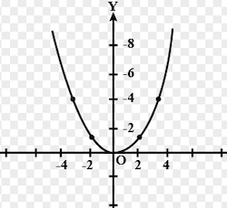
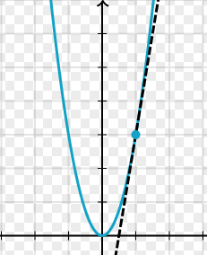

It is true libraries like scikit-learn have abstracted away most of the underlying mathematics used by engineers and data scientists in the field of machine learning, but I still generally hear a consensus from those in the industry that a knowledge of the underlying math is still valuable. I also submit, as a way of opinion, that any engineer in the field of machine learning should have significant interest in how these algorithms work and will find these sorts of topics interesting.

### Numbering Systems

*Natural Numbers* - 1, 2, 3, 4, 5... Only postive whole numbers. 

*Whole Numbers* - Adding the number 0 to the list of natural numbers. Not only is this a valid number prior to 1, but it also becomes the placeholder notion in a base 10 numbering system. 

*Integers* - Includes both positive and negative whole numbers. 

*Rational Numbers* - Any number that can be expressed as a fraction, such as 2/3. This includes all integers and finite decimals. Examples include 2/1 = 2 and 687/100 = 6.87. 

*Irrational Numbers* - Any number that cannot be expressed as a fraction because they are not finite. The famous example of this is pi which has decimals that go on for infinity. 

*Real Numbers* - This refers to both rational and irrational numbers. Anything that is not an imaginary number.

*Imaginary Numbers* - This is a result of taking the square root of a negative number. 

### Summation

A summation, expressed by the sigma character ∑ tells us to iterate and sum elements together. Consider this summation

$$
\sum_{i=1}^{n} x^2
$$

What this is notating is that starting at the number 1, iterate to the number n. For each iteration, take i and square it and then add to a tally of the summation. The end result of this is summing each value together after squaring it. 

### Exponentials 

Exponentials are pretty intuitive and I do not feel the need to go into detail about how to compute them. But the one more complex aspect we will see later is when computing the chain rule on multiple derivatives. When this happens, we will often need to calculate something similar to:

$$
(8^3)^2
$$

Often we need to simplify this before computing. The rules to simplifying this is to multiple exponents on different levels

$$
(8^3)^2 = 8^3*2 = 8^6
$$

When multiplying two exponential values
$$
x^2x^3
$$
we need to add these exponents
$$
x^2x^3 = x^2+3 = x^5
$$

When division of exponentials is happening
$$
x^2/x^5
$$
We cancel out the value at the top and then what is left over on the bottom becomes negative
$$
x^2/x^5 = 1/x^3 = x^-3
$$
Final one is understanding fractional exponents renders into a square root
$$
8^1/3 = 3\sqrt{8} = 2
$$

### Logarithms

A logarithm is a math function that finds a power for a specific number and base. To understand logarithms, consider the following equation
$$
2^x = 8
$$
The question we need to solve is what power do we need to raise our base (2) to in order to get 8? A logarithm is essentially a different notation for solving this exact same problem. The way we would notate that is
$$
\log_2 8
$$
In this example our base is 2 and the answer would be 3. Of course base 2 is just an arbitrary number and we could pick anything. But in data science we tend to default the base to eulers number. Eulers number is an irrational number approximated as 2.71828 and has the notation e. It tends to be used because it is a derivative to itself which is conveniant due to the amount of derivatives that are computed in machine learning. Using e as our based is refered to as *natural logarithm*. 

### Derivatives
 
A derivative tells us the slope of a function and is extremely useful for informing on the rate of change at any point in a function. I have not spoken much about functions so far, so I think a small example is required. Consider the function 
$$
f(x) = x^2
$$
The independent variable is the input while the dependent variable is the output. If we graph this function we will see something like this

Now if we wanted to find the derivative of f(2) (i.e. how 'steep' the curve is at f(2)), we could do this by drawing a *tangent* line as a straight line that "just touches" the curve at the given point. To do this we would take f(2) = 4 and f(2.1) = 4.41 and plot both points to determine our tangent line. 

We can then compute the slope of that line:
$$
m = y2 - y1 / x2 - x1
m = 4.41 - 4.0 / 2.1 - 2.0
m = 4.1
$$
So our derivative is 4.1. What we would find though is that the closer we made out two points together, the more accurate our result will be. f(2) and f(2.00001) will result in a slope of 4.0004. This is much closer to what is considered to be the accurate slope for this function, 4. 

For the purposes of computing derivatives in machine learning, there is a simplier approach. There are rules which can help transform our function in a different expression that we can use to compute the derivative. For example, when we encounter an exponential function like 
$$
f(x) = x^2
$$ 
we can make the exponent a multiplier and decrement the exponent by 1
$$
f(x) = x^2
(d/dx)f(x) = (d/dx)x^2 = 2x
(d/dx)f(2) = 2(2) = 4
$$

There are lots of rules to help us transform our functions into computable derivatives. I think it is sufficient to simply know this can be done for now. 

### Partial Derivatives

A partial derivative involves finding the derivative for an input in a function that takes multiple inputs. 
$$
f(x,y) = 2x^3 + 3y^3
$$
This function is going to map out into a three dimensional graph and will have multiple slopes based on the combination of all three coordinates. What we want to do here is figure out the slope for each input as a way of understanding the slope for one direction on our graph, assuming all others are held constant. We need to isolate each input parameter in the function to compute its own specific gradient
$$
f(x,y) = 2x^3 + 3y^3
(d/dx)2x^3 + 3y^3 = 6x^2$$ (above we multiply the exponent by the coefficient and decrement the exponent)
$$
(d/dy)2x^3 + 3y^3 = 9y^2
$$
So for (x,y) values of (1,2), the slope with respect to x is 6 and the slope with respect to y is 36. 

### The Chain Rule

One last topic that I think is important to cover is the chain rule. This is something I have run across a ton when building neural networks. it is actually foundational to how neural networks learn when using stochastic gradient descent. Consider these two functions
$$
y = x^2 + 1
z = y^3 - 2
$$
Notice that these two functions are linked since the output of y is used in the function to compute z. We could re-write this like
$$
z = (x^2 + 1)^3 - 2
$$
What makes the chain rule important is that it allows us to compute the derivative for z with respect to x in a super simple way. To do this, all we need to do is compute the derivative of y and the derivative of z separately and then multiply them!
$$
(dy/dx)(x^2 + 1) = 2x
(dz/dy)(y^3 - 2) = 3y^2
(dz/dx) = (2x)(3y^2) = 6xy^2
$$
The last step we need is to substitute y so that the entire derivative of z with respect to x is expressed without y. All that really means is inserting the y function for the y value so that the only values we need are x and z
$$
(dz/dx) = 6x(x^2 + 1)^2
$$
That is it. We have computed the derivative of z with respect to x. 
