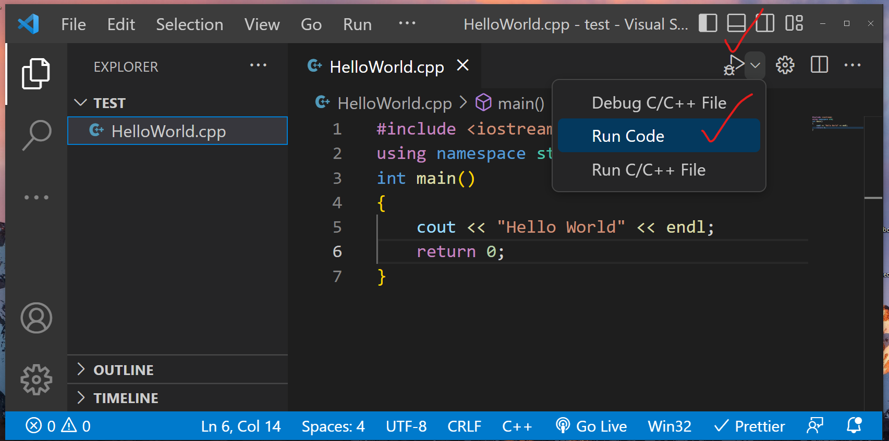

C++ is a dynamically typed compiled programming langauge. Which means unlike other langauges such as JavaScript and Python, C++ requires one further step to get it running on your machine. The C++ source code needs to be compiled from the source code written in C++ to machine code your computer can read and run. One thing that came as a surprise to me when I began working in C++ is that there is not one standard compiler. Instead there are a whole bunch used to produce production software on critical infrastructure all over the world. In a 2019 interview by Lex Fridman, Stroustrup explains why this is:

https://www.youtube.com/watch?v=ZQds2aGHwDA

I think his instincts here are right. The decentralized nature of building compilers for the language will tend to spurt innovation and discourage complacency. This is important for a language whose existence is largely tied to its runtime performance. On the other hand, it does introduce extra complexity into C++ development and increase the barrier of entry to those trying to get into the field. There is something clean and welcoming about Rust and its almost exclusive use of rustc.

Below are some high level things to know about C++ compilers. It is not exhaustive and I intend to have much deeper dives in the near future. 

### C++ Compiation Process

1. Pre-processing: A pre-processor will read the source doe and perform macro expansions, importing of header files, and other operations. These are generally seen in a C++ progress as #include, #define, #ifndef, etc. What comes out of this is often referred to as the translation unit. 

2. Compilation: The source code gets transformed into object code. This object code is a machine-readable representation of the translation unit, but not yet executable. 

3. Assembly: The object code next gets broken down into assembly code by an assembler. 

4. Linking: A linker will combine the assembly code with any libraries required by the program and also resolves any references to external symbols.

5. Execution: After linking, the compiler produces an executable file that can run on the system it was compiled for. 

The compiler will ensure that your program runs on the machine you are compiling for, taking into account both hardware and software specs to ensure your program is optimized for that system. The executable that results from the compiler may not work on other systems for that reason. When C++ makes the claim of being cross platform, what it means is your same source code should work on most platforms so long as you compile it for that platform. 

### Compilers

Here is a list of what seems to be the most prominent C++ compilers used today. 

1. GCC (GNU Compiler): GCC is a free and open-source compiler for various languages including C and C++. It works on Windows, Linux, macOS, and various other Unix-like systems. It supports all versions of modern C++ with the caveat that C++ 20 still only appears to have 'experimental support'

To compile a C++ program on a Unix based operating system, you would type something similar to:

```
g++ myprogram.cpp
```

The output is an executable that can now be run inputing this into the terminal:

```
./a.out
```

To help make this more precise with naming, you can compile with an extra name argument and then use that name when running the executable:

```
g++ -o main myprogram.cpp

./main
```

2. LLVM Clang: A C, C++, and Objective-C compiler that is the defalut compiler on macOS. Clang is known for fast compile times, high quality diagnostics, and optmized code generation. It also comes with a tool called Clang-Tidy which can be used to automatically format and clean up code. Like GCC, Clang is open sourced and available across most major platforms. As of now, Clang only has partial support for C++ 20 features. Which is confusing and slightly discouraging to a developer. 

Compiling on Clang is almost identical to GCC:

```
clang++ myprogram.cpp

./a.out
```

3. Microsoft Visual C++: This is a compiler that is part of Microsoft's Visual Studio IDE. It provides a rich code editor, build systems that can help automate compiling and linking. A debugger that supports breakpoints and a lot of other great features found in modern code editors. With the help of installed extensions like C/C++ Extension Pack and Code Runner, you can easily compile and run your C++ project using the IDE's UI. 



### Addendum

Compiling C++ programs can be complex. There are many extra arguments that can be passed in to customize the compiling process for the executable. These are usually referred to as flags or options. Amongst some of the most common:

```
-std=c++17 # C++ version
-O3 # Compile with a high level of optimization
-shared # Build as a shared library
```

Compiling a production level C++ program with multiple files quickly becomes too burdensome to easily do via the command line. Build systems like CMake are generally employed to help assist with that. 