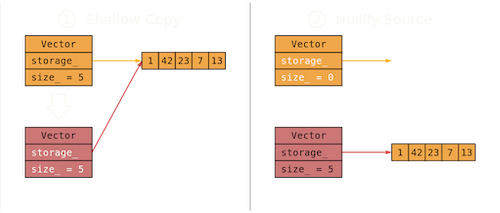

#### Constructors

It is fair to say C++ is not explicitly an object-oriented programming language. You can certainly use C++ with other paradigms. But C++ has all the tools needed for object orientation and has a long history of being used in that way. One of the foundational parts of an object in C++ is its constructor. The constructor is invoked automatically during the initialization of an object and, as we will see, can be overloaded in a bunch of different ways.

#### Default Constructor

This constructor has no arguments and can be automatically synthesized by the compiler if no other user-defined constructor exists.
```C++
Car c; // Invokes default constructor
```

#### Parameterized Constructor

The parameterized constructor has one or more arguments. It will accept one or more arguments and will never be synthesized by the compiler. The usage of a parameterized constructor will block the compiler from building a default constructor.

``` C++
class Integer {
        int m_Value;
        int n_Value;
    public:
        Integer(int value) {
            m_Value = value;
            n_Value = 0;
        }
        Integer(int m_Value, int n_Value) {
            this->m_Value = m;
            this->n_Value = n;
        }
}
```
The example above overloads the constructor with a couple of different options. Furthermore, you can see in the second constructor there was an ambiguous use of m_Value and n_Value between the named constructor parameters and the class members. To fix that, we use this-> as a pointer to the class that helps the compiler know which value we are referring to. One issue with the code above is it will no longer automatically build a default constructor for us. Attempting to set an Integer i1; will result in a compiler error, even though all the member values should default to zero and work fine. To fix this, we can tell the compiler to build the default constructor
```C++
class Integer {
        int m_Value{0};
        int n_Value{0};
    public:
        Integer() = default;
        Integer(int value) {
            m_Value = value;
            n_Value = 0;
        }
        Integer(int m_Value, int n_Value) {
            this->m_Value = m;
            this->n_Value = n;
        }
};
```
An often despised part of the C++ programming language is implicit conversions. This is something that needs to be looked out for when building constructors as well. Consider this example
```C++
class MyClass {
    public:
     MyClass(int x) {
        m_Value = x;
    }
    private:
    int m_Value;
};
void display(const MyClass& obj) {
    // Do something here
}
int main() {
    display(10);
}
```
This example compiles and runs because the compiler will implicitly convert the int 10 into MyClass. This is a scary prospect for a strongly typed language like C++ as it allows our program to be used in ways we did not anticipate or want. In most cases, it is best to mark the constructor as explicit to help ensure these types of conversions are not allowed
```C++
class MyClass {
    public:
     explicit MyClass(int x) {
        m_Value = x;
    }
    private:
    int m_Value;
};
void display(const MyClass& obj) {
    // Do something here
}
int main() {
    display(10); // compiler error, constructor is marked explicit
}
```
#### Initializer Lists
An initializer list in the constructor will initialize member variables to specific values just before the class constructor runs
```C++
Date::Date(int day, int month, int year) : year_(year) {
    Day(day);
    Month(month);
}
```
In general, unless an invariant needs to be applied to the argument being passed in, prefer initialization over assignment within the constructor. Initialization sets the value as soon as the object exists, whereas assignment sets the value only after the object comes into being. This means that assignment creates an opportunity to accidentally use a variable before its value is set. Initialization is actually a requirement for const member functions and for many use cases in dynamic polymorphism.
```C++
class Animal {
    std::string name_;
    public:
        Animal(std::string name);
        virtual void Talk() const = 0;
};
class Dog: public Animal {
    public:
        Dog(std::string name) : Animal(name) {};
        void Talk() const override;
}
```
Since the Dog inherits from the Animal, C++ requires we first initialize the Animal base class before we finish initializing the Dog.

### Copy Constructors

C++ supports value and reference semantics for different needs. Passing objects by pointer or reference essentially means passing the memory address of the object so that it can be modified in other scopes. Passing by value means making a copy of the object, data being allocated to a new memory space. When passed by value, any modifications done in one scope will not be reflective in another scope. For primitive data types like int, float, bool, etc, we are safe to almost always pass the variable around by value. But often we must be more careful when working with user-defined objects
```C++
class Integer {
    int *p_int;
public:
    Integer() { p_int = new int(0); };
    explicit Integer(int value) : p_int(value) {};
    ~Integer() { delete p_int; }
    int getValue() const { return *p_int; };
    void setValue(int value) { *p_int = value; };
};

void Print(Integer i) {
    std::cout << i.getValue();
}

int main() {
    Integer i(5);
    Print(i);
    int a = i.getValue();
    return 0;
}
```
Running this code may cause a crash in debug mode. The reason is because of how C++ default copies values when passing by value. By default, C++ does a shallow copy of the object. A new copy of primitive types will be made for the new object to be created, but for dynamically allocated data, C++ will end up copying the pointer to the new object instead of its underlying data. This is problematic when moving data between scopes because the following will happen:
1) We create a Integer class in Main() and pass it to the Print() function
2) Passing to the print function by value triggers a copy, a new Integer object is created and the p_int memory address is copied from the original Integer to the new one. 
3) The Print function finishes and the Integer class within the function goes out of scope triggering the destructor
4) The destructor properly cleans up its memory in order to prevent a memory leak by deleting the p_int. 
5) We call the getValue() function on the original Integer class which causes an error. This is because this Integer shared its memory pointer with the Integer class in the Print function which has now been deleted. We are trying to access dynamic data that no longer exists. 

We solve this problem by building out copy constructors for deep copies. 
```C++
class Integer {
    int *p_int;
public:
    Integer() { p_int = new int(0); };
    explicit Integer(int value) : p_int(value) {};
    Integer(const Integer &obj); // Copy Constructor
    Integer & operator = (const Integer *obj); // Copy Assignment
    ~Integer() { delete p_int; }
    int getValue() const { return *p_int; };
    void setValue(int value) { *p_int = value; };
};
Integer::Integer(const Integer &obj) {
    p_int = new int(obj.p_int);
}
Integer& Integer::operator = (const Integer &obj) {
    p_int = new int(obj.p_int);
    return *this;
}
```
Once these two constructors are built, the Integer class can safely be passed around by value without concern since a deep copy of the entire object will now be generated. When we pass the Integer class to the Print() function, the user-defined copy constructor will be called instead of the compiler-generated one which by default does the shallow copy.

### L and R Values
C++ differentiates between L and R values with major implications any C++ enigneer needs to be aware of. An L value:
1) is a variable with a name
2) can be assigned values
3) will persist beyond its expression
4) functions that return by reference return an l-value

An R value:
1) is a *temporary* value without a name
2) cannot be assigned values
3) does not persist beyond its expression
4) functions that return by value return an r-value

```C++
int main() {
    // Below, x is the l value and 12 is the r value
    int x = 12;
    int y = 10;
    int z = 8;
    // (x + y) is an express that returns a r-value
    int result = (x + y) + z;
}
```
We also need to differentiate between l-value references and r-value references
```C++
int &x = 12; // l-value reference
int &&y = 14; // r-value reference
const int &z = y; // const l-value reference
```
l-value references can only ever bind to l-values unless the reference is marked const. r-value references can only every bind to temporaries (r-values). The syntax here allows us to detect r-values in our code so that we can properly handle them. 
```C++
void Print(int &i) {
    std::cout << i;
}
void Print(int &&i) {
    std::cout << i;
}
int main() {
    int x = 12;
    Print(x); // This will call Print(int &i)
    Print(3); // This will call Print(int &&i). It would also call Print(const int &i) if that existed and r-value reference did not. 
}
```
### Move Semantics
Move semantics have two main use cases
1) Creating deep copies of some objects is too expensive and robs us of performance
2) Some objects need to be passed around from one scope to another, but we cannot allow there to be more than one instance of that object at any given time. 

When using move semantics, instead of allocating new memory in order to copy the data from one object to another, we instead have the new object 'steal' the memory from the initial object and then re-assign the memory in the initial object so that it no longer points to the memory we stole. This solves the problem of having to allocate new memory (an expensive operation) and having to worry about an object deleting memory we still want to use when it goes out of scope



This will invalidate the original object since it no longer has a correct pointer to its dynamic data, but this is usually of no concern since it is a temporary (r-value) anyway. By adding overloaded constructors for r-values in our object, we can support moving these objects as r-values and improve the performance of our program
```C++
class Integer {
    int *p_int;
public:
    Integer() { p_int = new int(0); };
    explicit Integer(int value) : p_int(value) {};
    Integer(const Integer &obj); // Copy Constructor
    Integer & operator = (const Integer &obj); // Copy Assignment
    Integer(Integer &&obj);
    Integer& operator = (Integer &&obj);
    ~Integer() { delete p_int; }

    int getValue() const { return *p_int; };
    void setValue(int value) { *p_int = value; };
};
Integer::Integer(Integer &&obj) {
    p_int = obj.p_int;
    obj.p_int = nullptr;
}
Integer& Integer::operator = (Integer &&obj) {
    p_int = obj.p_int;
    obj.p_int = nullptr;
    return *this;
}
```
With these new constructors in place, when passing an Integer to a function by value where that function will return an Integer itself, we should no longer expect the deep copy from the copy constructor to be performed. Instead, the Integer within the Print() function will be returned as an r-value and efficiently moved back to the main() function as the returned Integer (this ignores that C++ often avoids all this using copy elision). 

### The Rule of 5

If a class defines any one of the following constructors, it should define them all
- Destructor
- Copy Constructor
- Copy Assignment Constructor
- Move Constructor
- Move Assignment Constructor

### std::move

Finally, there are times where we want to force our object to be moved as an r-value even when by default C++ would not consider doing this. There are two reasons for this:

1) This will be more efficient and we no longer need the original object after forcing it into its r-value form to be moved elsewhere. 
2) The object does not allow us to copy it. This could be either for business logic reasons or because of the nature of the object. This is usually done by setting the copy constructors to = delete
```C++
class Integer {
    Integer() { p_int = new int(0); };
    explicit Integer(int value) : p_int(value) {};
    Integer(const Integer &obj) = delete; // Copy Constructor
    Integer & operator = (const Integer &obj) = delete; // Copy Assignment
    Integer(Integer &&obj);
    Integer& operator = (Integer &&obj);
    ~Integer() { delete p_int; }
};
```
When this is done, we have no choice but to pass an object by r-value only. But how can you do this? C++ supports forcing an object to be an r-value by using the std::move() feature. 
```C++
void Print(Integer i) {
    std::cout << i;
}
int main() {
    Integer ii(1);
    Print(std::move(ii));
}
```
std::move() forces the object to use the move constructor when creating the i Integer within the Print function instead of the copy constructor. The pro of this is the efficiency we gain from such an operation, the negative is if we try to use the ii variable after calling the Print function in main(), we will likely have undefined behavior since its data has been moved.