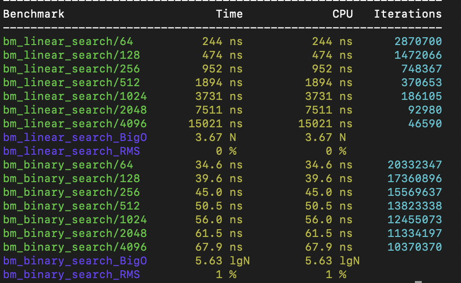

### Microbenchmarking

Microbenchmarking is used when attempting to optimize a function or small block of code. This involves creating a program that runs the code to be optimized in isolation from the rest of the program. The process follows these steps:

1. Find a hot spot that needs tuning, preferably using a profiler. 
2. Seperate it from teh rest of teh code and create the isolated benchmark
3. Optimize the microbenchmark using a benchmarking framework. 
4. Integrate the newly optimized code into the program and measure again to see if the optimization is relevant when the code runs in the context of the full program. 

Measuring the speed up from microbenchmarking can be done with the help of *Amdahl's law

Speedup = 1 / ((1 - P) + (P / N))

Where:
- `Speedup` is the overall speedup of the system.
- `P` is the proportion of the task that can be parallelized.
- `N` is the number of processors.

Setting p = 0 and s = 5x means the part we optimized had no impact on the overall execution time. Setting p = 0.01, s = 2x means we have an improvement of 1.005. 

### Example in C++

The following example was done using Google Benchmark (https://github.com/google/benchmark)

1. I first cloned the benchmark to my local machine
```
git clone https://github.com/google/benchmark.git
```

2. I navigate to the directory and run these commands to build the framework and install it into a C++ library directory I keep on my local machine
```
cd benchmark
mkdir build && cd build
cmake .. -DCMAKE_INSTALL_PREFIX=$HOME/Desktop/Libraries
make
make install
```
3. Next I started a new C++ project to consisting of two files (CMakeLists.txt and main.cpp). My CMakeLists.txt was very basic:
```C++
cmake_minimum_required(VERSION 3.0)
project(benchmark-test) # I was sure to set my CMake path to -DCMAKE_INSTALL_PREFIX=$HOME/Desktop/Libraries

set(CMAKE_CXX_STANDARD 17)

find_package(benchmark REQUIRED)

add_executable(benchmark_test main.cpp)

target_link_libraries(benchmark_test benchmark::benchmark)
```
4. Lastly was writting my C++ file for benchmarking. For this example I benchmarked a linear and binary search algorithm for a vector. The two functions I am testing (and microbenchmarking against to optimize)
```C++
bool linear_search(const std::vector<int>& v, int key) {
    for (size_t i = 0; i < v.size(); i ++) {
        if (v[i] == key) {
            return true;
        }
    }
    return false;
}

bool binary_search(const std::vector<int>& v, int key) {
    int low = 0;
    int high = v.size() - 1;
    while (low <= high) {
        const int mid = (high + low) / 2;
        if (v[mid] < key) {
            low = mid + 1;
        } else if (v[mid] > key) {
            high = mid - 1;
        } else {
            return true;
        }
    }
    return false;
}
```
I have this function to build out a vector for testing:
```C++
auto gen_vec(int n) {
    std::vector<int> v;
    for (int i = 0; i < n; i++) {
        v.push_back(i);
    }
    return v;
}
```
Next I need to build out another function for each piece of code I am testing. This function needs to be static and should take a bechmark::State& parameter. The state will tell me how large the size of the array will be based on parameters I give the framework later using the range() function. Run a for loop through the state and tell the benchmark not to optimize. Finally we will have the framework guess the time complexity by calling the set SetComplexityN() function on the state. 
```C++
static void bm_linear_search(benchmark::State& state) {
    auto n = state.range(0);
    auto v = gen_vec(n);

    for (auto _ : state) {
        benchmark::DoNotOptimize(linear_search(v, n));
    }

    state.SetComplexityN(n);
}

static void bm_binary_search(benchmark::State& state) {
    auto n = state.range(0);
    auto v = gen_vec(n);

    for (auto _ : state) {
        benchmark::DoNotOptimize(binary_search(v, n));
    }

    state.SetComplexityN(n);
}
```
When microbenchmarking, you will not have a main function. Instead pass the functions you will be testing into a BENCHMARK function and then set BENCHMARK_MAIN(). You will see by setting the RangeMultiplier we will get the benchmark to test with a bunch of different input sizes. 
```C++
BENCHMARK(bm_linear_search)->RangeMultiplier(2)->Range(64,4096)->Complexity();
BENCHMARK(bm_binary_search)->RangeMultiplier(2)->Range(64,4096)->Complexity();
BENCHMARK_MAIN();
```
5. Once complete, I run:
```
cmake .
make
./benchmark_test
```
This will compile and run the program. The results on my machine looked like this:



Not surprisingly, a binary search is significantly faster. On a vector with 4096 items, it took the linear search function 15021 nanoseconds and only 67 nanoseconds for the binary search. Information about the Big O is also included which can be very helpful for more complex algorithms. 

There is obviously a lot more that can be said about microbenchmarking and more that can be done with Google's framework. But what has been said above is enough to hit the ground running.