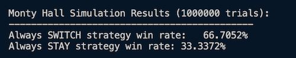
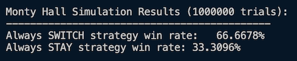
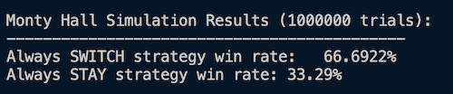

## Introduction
***Let's Make a Deal*** was an American television game show first airing on NBC December 30th, 1963, and hosted by the venerable Monty Hall. The premise of the show was that members of the audience, known as "traders," engaged in making deals with the host. In most cases, a trader will be offered something of value and given a choice of whether to keep it or exchange it for a different item. The program's defining game mechanism is that the other item is hidden from the trader until that choice is made. The trader thus does not know if they are getting something of greater value or a prize that is referred to as a "zonk," an item purposely chosen to be of little or no value to the trader. The show has had a very successful run over the years, having now aired in different forms all around the world. 

Aside from its successes on television, the show also inspired the Monty Hall Problem, a probability puzzle designed to exhibit how our intuitions about probability can be remarkably wrong and challenging to overcome. Simplistic in its construction, the Monty Hall Problem has a reputation for tripping up most people who participate in the game. In one recent study, only 13% of participants were able to properly reason through the game and its probabilities [^1]. Writes cognitive psychologist Massimo Piattelli-Palmarini, "No other statistical puzzle comes so close to fooling all the people all the time, and even Nobel physicists systematically give the wrong answer, and they insist on it, and they are ready to berate in print those who propose the right answer" [^2].

The game goes as follows: a game show participant is shown three closed doors. Behind one of the doors is a new car, and behind the other two are goats (the zonk). The participant is told that whatever prize is behind the door of their choosing at the end of the game will be theirs to take home. The game starts with the participant choosing a door. After their initial choice, the game show host (who knows which door contains the brand-new car) opens one of the two remaining doors that the participant did not select, revealing a goat. The game show host always reveals a door with a goat behind it and always follows up this reveal with a final proposal prior to the end of the game. The host asks if the participant would like to keep the door that they originally chose or switch to the other remaining door. Once the participant makes their final decision, all doors are opened, and the participant learns if their chosen door possessed a brand new car or a goat.

## Exploring Our Intuition
The mechanics of the game are simple and do not change each time a participant plays. They are originally given a choice between three different doors, where each door is just as likely as the next to have a car behind it. Each participant can likely identify they have a 1/3 chance of picking the correct door. After the initial choice, the host always opens one of the doors that has a goat behind it, leaving two doors left, one of the two of which has the car behind it. When asked if the participant wants to keep the door they originally chose or switch to the other remaining door, most participants see two equally enticing choices. From the perspective of the participant, they see two doors and know the car is behind one of them. Since both doors seem just as likely to have the prize as the other, the question then becomes, how does a participant choose between these options when they believe there are equal odds of success? The answer, demonstrated by multiple studies, is that most participants choose to stick with their original door and forgo switching. When asked why, participants tend to answer that if they do lose, they would feel worse if they had lost because they switched away from the winning choice. Here, it seems, human psychology kicks in, and with everything else being equal, people tend to minimize regret where no further maximization of their chance to win seems attainable.

This line of thinking is reasonable enough. If a participant believes there is no way to miximize their chance of winning then the only outcome truly under their control is how they will feel once the outcome is made known. If the participant wins, we should expect they will care little if they won by sticking or switching. But if they lose, there is something to be said for the psychological discomfort that comes with knowing you had at one point made the right choice and switched away from it. Given what appears to be a 50-50 chance of making the correct choice once the host reveals one of the doors with a goat behind it, sticking with an existing door does lend itself as a rational strategy to minimize regret. 

This, unfortunately, is the wrong choice. As it turns out, when given the option to switch, a participant will statistically maximize their chance of winning if they switch. In fact, users who switch doors win 66.6% of the time, whereas users who stick with their original door only win 33.3% of the time. 

## Let's Get Empirical
This is a bold claim, and it flies in the face of our intuition. The initial state of the game provides the participant with three doors and a 1 in 3 chance of picking the right door. A door is then opened, which changes the state of the game so that now only two doors remain, one of the two which has the prize behind it. If there remain only two doors and a prize exists within one of them, it seems the participant should now have a 1 in 2 chance of having picked the right door. Furthermore, the host allows the user to switch doors, which is equivalent to allowing the user to pick again between the two choices. So how can it be that in a scenario in which each of the two doors seems equally as likely to contain the prize, picking the door we did not originally choose increases our odds of winning by so much?

Before we dive in further, I think it first serves us to verify this truly is the case. To do so, I wrote a small [program](https://github.com/crweaver225/MontyHallSolver) in Haskell that simulates two participants playing the game 1 million times each. One participant switches doors each time they play, and the other participant always keeps their original selection. I then tabulate the outcome for each game and break it down into a winning percentage:

```Haskell
{-# LANGUAGE NumericUnderscores #-}

import System.Random (randomRIO)
import Control.Monad (replicateM)

simulateMontyHall :: Bool -> IO Bool 
simulateMontyHall switchDoor = do

    playerChoice <- randomRIO(0 :: Int, 2) 
    prizeDoor <- randomRIO(0 :: Int, 2)

    let possibleDoors = [0,1,2]
        hostChoices = filter (\d -> d /= playerChoice && d /= prizeDoor) possibleDoors 
    
    hostChoice <- case hostChoices of 
        [x] -> return x 
        xs -> do 
            index <- randomRIO(0,1)
            return (xs !! index)
    
    let finalChoice = 
            if switchDoor 
                then head $ filter (\d -> d /= playerChoice && d /= hostChoice) possibleDoors
                else playerChoice

    return (finalChoice == prizeDoor)

main :: IO ()
main = do

    let numTrials = 1_000_000

    playerSwitches <- replicateM numTrials $ simulateMontyHall True 
    playerStays <- replicateM numTrials $ simulateMontyHall False 

    let playerSwitchesWins = length $ filter id playerSwitches
        playerStaysWins = length $ filter id playerStays
    
    let playerSwitchesWinPercentage :: Double 
        playerSwitchesWinPercentage = fromIntegral playerSwitchesWins * 100 / fromIntegral numTrials
    let playerStaysWinPercentage :: Double
        playerStaysWinPercentage = fromIntegral playerStaysWins * 100 / fromIntegral numTrials
    
    putStrLn $ "\nMonty Hall Simulation Results (" ++ show numTrials ++ " trials):"
    putStrLn "--------------------------------------------"
    putStrLn $ "Always SWITCH strategy win rate:   " ++ show playerSwitchesWinPercentage ++ "%"
    putStrLn $ "Always STAY strategy win rate: " ++ show playerStaysWinPercentage ++ "%"

    putStrLn "\nSuggested best strategy: "
    if playerSwitchesWinPercentage > playerStaysWinPercentage
        then putStrLn "Always Switch\n"
        else putStrLn "Always Stay\n"
```
Below are the outcomes of running the program three seperate times. Despite randomly distributing the prize amongst the three doors each time, the results are remarkably consistent:





In all three simulations (one million iterations per simulation), the results were consistently showing that switching doors resulted in the participant picking the door with the car behind it 66% of the time, whereas sticking with the original door only resulted in picking the correct door 33% of the time. As perplexing as it seems, this validates the claim and requires a deeper dive into the problem set to see what is going on. 

## Course Correcting Our Intuition
So what is going on here? How is it that we can increase our odds of winning to 66% based on picking between two different doors? Specifically given the fact that we do not know which door the prize is behind. The answer is that the host does significantly more than we originally thought when he reveals one of the doors to be concealing a goat. It is not simply that he has reset the game so that the user has a 50/50 shot between two doors with no further information to go on. No, he has tipped his hand significantly more than that. When a participant initially chooses a door, they have a 1/3 chance their door has the prize behind it. That also means there is a 2/3 chance the prize is behind one of the other two doors that the participant did not pick, which becomes the subset of unchosen doors. Here is where most make their mistake. We presume once the host reveals a door with a goat behind it that the odds of our door being the correct choice now increase from 33% to 50%, but this is not the case. Because the host ALWAYS chooses a door not chosen by the participant but always with a goat behind it, the odds behind our original assessment have not really changed. At the end of the game, our original door will still be the correct door 1 out of every 3 times. Opening another door with a goat behind it cannot possibly influence the space-time continuum and time travel backwards to change the fact that the car will be behind the door we originally choose at a 33% rate. But since the chance the car is behind our original door is always 33%, this means that the chance the car is not behind the door we choose is still 66%. And here is what the host has really done for us that most people do not originally understand. There remains only one choice left amongst the doors the user did not choose. That 66% chance shared between two doors has now been shifted to the unchosen door that the host did not reveal. That door now has a 2 in 3 chance of being the correct door and begs for the participant to switch. A pleading that largely falls upon the deaf ears of each participant. 

Another way to think about this that helps is to expand the number of doors within the game. Consider instead of three doors that the participant had chosen one door amongst one hundred doors. The host then opens 98 doors, all with goats behind them, and once again asks if you would like to switch. The mechanism of the game has not changed, but now switching doors puts you at an amazing advantage with a 99% chance of winning the car. Once again, we can correctly intuit that our initial pick has a 1 in 100 chance of being the correct door, which means there is a 99% chance it is in the subset of doors not chosen by the user. Because the host will always open up 98 of the 99 doors within this subset, he is essentially giving us a clue that IF the car is within the subset of doors that we did not pick (but had a 99% chance of being the subset in which the car was in), it would be in the one remaining door he did not open. This is a massive hint that applies just as much to our original example of three doors, just with different percentages. 

What breaks our intuition with this problem is we fail to properly assess the new information given to us after our initial choice. Participants operate as if they are given a fresh slate between two choices, each just as likely as the next to have the prize. But multiple pivot points made during the game impart additional information to the game that negate the idea of a fresh slate. The first pivot point is when the user makes their initial pick. This pick creates two subsets of doors: the 1/3 of doors the user had picked and the 2/3 of doors they had not. We know the subset of doors the user did not pick has a 66% chance of having the prize, but this is of no help on its own as we do not know which of those two doors has the prize, and we are not allowed to pick a subset of doors, only a single door. The kicker is that the decision made by the participant forces the host to reveal all doors within that subset that do not have the prize, which produces a new piece of information we otherwise would not have. If the host initially opened a door prior to the participant making a pick, we would be correct to think we have a 50% chance of picking the right door, but forcing the host to open all doors except one within the subset of our choosing brings to light a new piece of information that, when combined with our initial assessment, gives us a significant advantage when making our final choice.

## Implications
Countless many have found their personal finances severely harmed by the existence of the gambler's fallacy, a mistaken belief that independent past events influence future ones. If a flipped coin comes up tails 9 times in a row, many are quick to think heads is more likely on the tenth flip since we all know coin flips should trend towards a 50/50 split over time. We tend to reason that each additional flip that results in tails after the first nine makes the sequence of flips significantly less likely and hedge this unlikeliness by presuming future outcomes will hasten a regression to the mean. This, of course, is called a fallacy for a reason, as each flip of the coin is an entirely independent event, and no previous set of results will influence the next flip. But its prevalence in human thinking demonstrates how our intuition about certain things can often be disjointed from reality. Our brains are massive correlation machines, discerning regularities and structure in a complex and noisy world. We look for patterns and use these patterns as a model to make future predictions about the state of the world. We learn from an early age that where we see smoke, there is often fire. This pattern matching is finely tuned and works reasonably well for the world around us, but it is very far from perfect. 

Our intuition is the culmination of lots of neural computations happening behind the scenes in our heads. It is the engine behind most of our decision-making throughout the day and is largely inaccessible to conscious awareness. Very rarely are people computing the geometric curve of the road they are driving on in order to determine how much to turn the steering wheel. Instead, we have intuitively built a good sense for how to steer a car through repetition that allows us to largely delegate the task little of our actual focus while we drive. Whenever we purchase or sell something in bulk at a discounted rate, we are doing so in accordance with the law of marginal utility, an economic principle which explains why such discounts are highly rational. But very few people have even heard of, let alone understood, what the law of marginal utility even is. Instead, this behavior arises from finely tuned intuition most of us have built up over time (or perhaps it is in part genetically ingrained into us?). Much of our capacity to act in a way that maximizes our goals in the world is not due to us analyzing various outcomes with any real level of sophistication, but instead it is more driven by our intuition. But as amazing as this intuition can be, it can often lead to wrong conclusions in ways that are hard to overcome. Despite the analysis done above on the Monty Hall problem, it still doesn't *feel* correct that switching doors should incur any sort of benefit whatsoever. But it does. And the fact that it does should be a call to embrace humility and to reconsider many of the other ideas and beliefs we hold that might be driven by faulty intuition. 

In Plato's Euthyphro, we encounter a man attempting to prosecute his own father for the death of a servant. Despite the objections of his own family, Euthyphro says he is bound by piety to ensure his father is held accountable for his actions. What ensues throughout the book is an attempt by Socrates to get a clear, comprehensive definition of what piety is from Euthyphro, which Socrates argues he certainly must have since he justifies his actions against of his own father based on it. But what we find as the dialogue progresses is that a good definition of piety that is without contradiction is really hard to come up with and is potentially outside the reach of our intellectual capacity. After having failed many times to define piety, Euthyphro eventually excuses himself from the conversation, and the audience is left wondering what the fate of Euthyphro's father will be in the wake of his son's failure to coherently justify the reason for prosecuting him. This is a recurring theme in Plato's work, highlighting that we often act on a sense of justice, piety, and honor despite the fact that we have no good way of defining these things. Instead, these concepts of ours arise from our intuition. As was so famously stated by Supreme Court Justice Potter Stewart when defining the threshold for obscenity:

 "I shall not today attempt further to define the kinds of material I understand to be embraced within that shorthand description ["hard-core pornography"], and perhaps I could never succeed in intelligibly doing so. But I know it when I see it"[^3] 

Even at our highest levels of contitutional law, so much of how we operate involves using concepts that we cannot well define, but intuitively we seem to be able utilize when given concrete examples. We just know it when we see it. This is our intution at work. But as has been discussed, our intuition must be viewed with more suspicion going forward, for it is not always aligned properly with the realities of the world. If our intuition about something as simple as the probabilities of a prize behind one in three doors is so off, then it stands to reason we often might be misaligned in our thinking on more complex issues of greater importance. Things like politics, religion, and moral accountability might be more complex and outside our intellectual grasp than we often assume. On such issues, we must pursue a greater sense of humility. Humility applied to our sense of comprehension will not within itself make us right more often, but it will make us wrong less often, and being wrong less often is a worthy first step on the path towards making decisions that minimize the number of goats we end up with in life, both as individuals and as a species.  

Footnotes
[^1]: Granberg, Donald; Brown, Thad A. (1995). "The Monty Hall Dilemma". Personality and Social Psychology Bulletin. 21 (7): 711–729. doi:10.1177/0146167295217006. S2CID 146329922.
[^2]: vos Savant, Marilyn (1996). The Power of Logical Thinking. St. Martin's Press. p. 5. ISBN 0-312-15627-8.
[^3]: 378 U.S. at 197 (Stewart, J., concurring) (emphasis added).