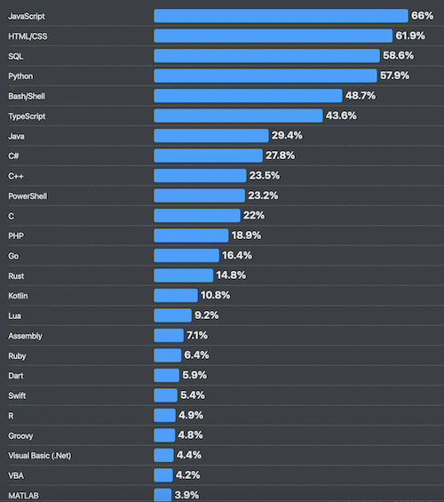

It is a phrase as old as time. A reductio ad absurdum recited by parents to their children in one form or another in households across the globe. *If your friends jump off a bridge, would you jump too?* The question is rhetorical, of course, at least in most cases, and is designed to encourage kids to refrain from engaging in poor behavior in the face of peer pressure. But at a deeper level, this question is meant to cast doubt on the wisdom of the crowd. Is it always true that decisions made by larger groups of individuals tend to be better than those of a single expert? As a child growing up at the height of popularity for the TV show Who Wants to be a Millionaire?, we all knew it was generally a good choice to lean on your lifelife to ask the audience when in doubt. Some studies found that the audience on that show was correct an astounding 91% of the time. Indeed, there is wisdom in the herd; but does that mean we follow them off the bridge? 

Enough with all this talk of bridges and hypothetical ponderings about one's mode of exiting from said bridges. There are more concrete examples where the wisdom of the herd frames and influences the decisions we make. Wearing a toga during summer months may sound like a great way to keep cool and increase airflow to areas of the body most desperate for it, and yet most of us don't do it. Can the same be said for our technology stacks? In the 2025 Stack Overflow survey of the most popular programming languages, we see JavaScript and Python absolutely dominate the list. Java, C#, and C++ remain frequently popular as well within the second tier. New languages like Rust, Go, Swift, and Dart have all found solid footing in the software development world and have consistently been grabbing a larger share of the amount of software powered by their technologies. But relevant to the title of this post, I think it's worthwhile to ask where on this list does Haskell fall? The answer is that it does not even make the list. The cutoff apparently is at COBOL at 1%. COBOL, the antiquated language of the 1960s, now largely relegated to a few mainframes in government offices and banks, makes the list, while Haskell does not even receive an honorable mention.



The popularity of Haskell certainly leaves something to be desired. Its use in industry is so small one would be forgiven for thinking it a dead language. In fact, that often appears to be the understanding of Haskell's status when I tell people that's what I program in for a living. I am often met with a quizzical look and some response along the lines of "I did not know anyone still used Haskell outside of university research labs." Mea culpa for breaking their world model of software development. Haskell is alive. Small, but alive. 

For me, Haskell was a choice. I was well aware its footprint in the corporate world was very small. I was aware career opportunities would be limited. And yet I choose to spend countless personal free hours learning the technology and reorienting my career trajectory towards the language and its niche usage in the world of professional software development. I can defend my decision. But I face a steep hill in doing so. Certainly Haskell's lack of use compared to popular programming languages like Python, JavaScript, and C++ is not purely coincidental. In the marketplace of programming languages, businesses and engineers choose the language that best helps meet their ends. Their choice of programming language often has massive implications for the health of their organization and software. These choices cannot be arbitrary. Certainly, this suggests Haskell's lack of use means it's a poorly designed language that cannot deliver as a useful engineering tool for developers and industry. All of the software development industry jumped off the bridge in pursuit of Python, JavaScript, and Java; how can I justify not following them? 

When I was a kid, one of my favorite places to be was Space Mountain at Disney's Magic Kingdom. The ride was enclosed by a domineering and yet sleek retro-futuristic building. A combination of sharp lines and geometric curves invoked an inspirational view of technology and the future.

 

The technology within the ride was meant to be an invisible part of the infrastructure. Present and powerful, yet largely relegated to working behind the scenes and in a way that lends itself to almost being forgetable. This was the hopeful future of technology I always found compelling. Not a kaleidoscope of screens, dashboards, chatbots, and other technological noise front and center for people to engage with. Not the cyberpunk world of the present with all the flashing screens. The retro-futuristic technology I envisioned was clean, pure, and reliable. Like the Space Mountain building itself, it would be something you can marvel at both because of its sophistication and because of its simplicity. It is technology that just works, quietly serving its purpose with a soft hum that extends infinitely into the future. This is what Haskell is. This is the future Haskell offers to those ready and willing to take up its torch and build with it.

Haskell is a paradigm shift. It's a different way of building computer systems. Sometimes, a better way. Marketed as a pure functional programming language, Haskell lives in a realm where software is desired as both a means to an end and an end within itself. Yes, Haskell is used to write programs that businesses can leverage to serve their customers and employees. In that way, it is a means to an end where engineers using the language must consistently engage in pragmatism and balance out different tradeoffs between different choices on how the software is built. As Claude so recently told me during my evaluation on how to solve a specific problem I was facing at work, even in Haskell, sometimes pragmatism needs to win over purity and elegant architecture. But Haskell by its very nature often feels like an end within itself. It encourages engineers to write software using syntactic structure that is, in itself, beautiful. It nudges developers towards solutions that are concise, maintainable, and less fundamentally brittle than is often pursued by engineers working in other programming languages. By way of analogy, Haskell is the Empire State Building, whereas other popular programming languages are the Sears Tower[^1]. Both functionally work as large buildings that provide vast amounts of usable indoor space while only taking up a very small amount of actual land. But while the bundle tube design of the Sears Tower meant it could be constructed at a smaller cost, the Empire State Building simply offers an architectural grandeur in its Art Deco style that the Sears Tower simply does not have. 

So what is it that makes Haskell unique? Repeated as nauseum across many hundreds of different blog posts on the matter, Haskell is generally marketed as a functional programming language that offers programmatic purity in a way no other language can. The emphasis on this is not misplaced. Functional programming concepts continue to drive a large amount of the evolution programming languages have adopted over the past decade or so. The enthusiasm for object-oriented programming has waned to a surprising degree as the promise of easily mapping problem domains to inheritance structures failed. Programming languages like Java and C++ have added things like anonymous lambda functions and composable higher-order functions to their toolbelt. These new features are generally celebrated as better, more modern, ways of programming within the literature.

Functional programming clears away much of the clunky organizational-specific abstractions that get built with the intention of mapping domains in a way that is easier for teams of developers to intuit. In theory, objects in a program can encapsulate much of the complexity behind simple interfaces and allow different teams to leverage the power of these objects without ever needing to understand that complexity behind the curtain. In reality, objects awkwardly map to the problems businesses are trying to solve. Complex hierarchies of inheritance get built to alleviate this awkwardness, end up increasing programmatic indirection, and blow up the limited context window of the engineer trying to comprehend how everything maps to one another. Worse yet is that these objects possess state within them that often leads to unexpected runtime behavior. Much like in the Wizard of Oz, object-oriented programming asks that we refrain from peeking behind the curtain and trust that all is as it appears to be. And it is true that ignorance is often bliss, that is, until you receive that call at 3 am that the system is down and you wonder to yourself if the Emerald City might have built its foundations on sinking sand. 

Haskell promises something quite different. It offers grouping related data together.
```Haskell
data Person = Person {
    firstName :: String,
    lastName  :: String,
    age       :: Int 
}
```
It offers functions that operate on these data types.
```Haskell
birthday :: Person -> Person
birthday person = person { age = age person + 1 }
```
And all of this can be encapsulated into modules to ensure some of the behind-the-scenes mechanics of your code are not exposed for abuse by others. But inheritance hierarchies are not a part of the language. Instead, Haskell provides two extremely powerful alternative approaches to accomplishing the same goals many other languages attempt to solve with inheritance. The first is algebraic data types for representing different variants of the same thing.
```Haskell
data Shape
    = Circle Double
    | Rectangle Double Double

area :: Shape -> Double
area (Circle r) = pi  r  r
area (Rectangle w h) = w * h
```
Instead of having an abstract Shape class with child classes to implement different types of shapes, Haskell uses these sum types in a much cleaner way. But more importantly, Haskell eliminates an entire class of bugs because the compiler always requires any interaction with the Shape type to do an exhaustive pattern match on all the possible variants. The second approach is for providing shared behavior across different types using typeclasses. 
```Haskell
class Shape a where
    area :: a -> Double

data Circle = Circle Double

instance Shape Circle where
    area (Circle r) = pi  r  r

computeArea :: Shape a => a -> Double
computeArea s = area s
```
Here we define what functionality a shape has and then define a generic function that takes anything that implements the Shape typeclass, which will expose the functionality for the specific type we pass in. These two features heavily inspired Rust's match statements and type traits, two of the language's most popular features.

These features are great. They allow developers to write complex software in a way that is easier to reason about and maintain. But it's just a small sliver of the clarion call to adopt Haskell. What makes Haskell unique in an interesting and unique way is its emphasis on determinism and declarative programming. Haskell emphasizes determinism through purity and referential transparency. Digital systems derive their value because their deterministic manipulation of symbolic states offers precision and reliability. As I have offered [elsewhere](/philosophy/technology-and-the-nature-of-intelligence/), digital systems were found to be superior to their analog counterparts because their precision meant they could flexibly represent more things. "Precision" and "flexibility" may sound contradictory at first glance, but please do not second-guess the great Alan Turing on this point. Precision requires determinism. Determinism requires that the same input into a machine always produces the same output. This is the cornerstone of automation. Even computer programs designed for empirical study, where the outcome is not [predictable](/philosophy/conways-game-of-life-epistemological-considerations/), often require we have small, reproducible steps to help make the process scrutable. Haskell makes determinism a core tenant of the language. Everything is immutable, which means all functions are by default pure. The same input will always produce the same output. 
```Haskell
totalPrice :: [Double] -> Double
totalPrice xs = sum xs * 1.07
```
It does not matter what is happening on other threads of your program; it does not matter what the user is clicking on with their mouse or keyboard at the moment this function gets executed. Calling the totalPrice function with a specific list of doubles will ALWAYS produce the same output. No state within the program will change this fundamental fact, which in turn eliminates a whole class of bugs and makes reasoning about the code significantly easier. Anything that can modify the program at runtime and introduce unpredictability requires explicit machinery that forces engineers to properly handle its potential consequences in a safe manner that does not violate emphasis on purity and determinism. Generally impure code sits at the edge of the program within the limited scope of do syntax that cannot "infect" the rest of the program's runtime. 
```Haskell
main :: IO ()
main = do
    line <- getLine
    print line
```
Other languages like C++ do not offer such promises.
```C++
int square(int x) {
    static int calls = 0;
    calls++;
    return x * x + calls;
}
```
Any function similar to this one introduces changes in state that are very difficult to reason about and ensure predictability at runtime. Mutable state has historically been a large part of other languages' mechanics, and we have paid the price for this over many decades with buggy software that lacks robustness. Haskell requires additional attention and work in order to interact with anything outside of the program itself, but this is for good reason. 

Purity is a philosophical choice that Haskell adopts to emphasize powerful software that operates predictably and safely. Software development requires working on complex systems with thousands of moving parts. Ensuring each moving part refrains from impacting another moving part in a detrimental fashion keeps most developers in a state of continual fear. Haskell is a sanity pill, a voice of reason telling us we do not need to live this way. What you the developer have written elsewhere will not turn into Frankenstein's monster and wreck havoc at any point in the future. Instead, it is pure, and it is local. Modular functions are sandboxed and produce no state we must worry about at any time in the future. As a colleague of mine once said, "Haskell doesn't make I/O complex. It reveals that I/O is complex." This revelation is adopted into the language, and steps are taken to constrain its scope. The result is deterministic software.

Determinism is one side of the coin for why Haskell offers us a better future. The other is that Haskell is declarative as opposed to imperative. Imperative programming, the primary paradigm in software engineering, is a process by which developers write out a long list of very precise steps for the computer to follow. The purpose of executing each step one at a time in the order provided is that a specific desired outcome will be accomplished at the end. Because computers only know a handful of very specific instructions (move this value to this place in memory, add these two values together, etc.), the steps listed out in a program become incredibly lengthy and complicated. This is why most software sophisticated enough to do anything interesting tends to be tens of thousands to millions of lines long. Imperative programming works, but it's very hard and intellectually demanding on developers. Non-trivial outputs require writing hundreds of precise steps in perfect order. Engineers need to continually keep a running model in their head of where they are in a long sequence of instructions, ensuring the next line of code properly fits with all previous steps and extends the sub-routine closer towards the final desired outcome. I am reminded of an implementation of a convolutional neural network I did a few years [back,](https://github.com/crweaver225/CAINN/blob/fa45378a14ed036528181df6a4630090d50dad1a/src/Vision.cpp#L275) which involved writing a complex function with seven nested for loops[^2]. Keeping track of what was happening within each loop and with each additional line of code (instruction) was incredibly difficult. Particularly as I needed to simultaneously think through
1) How a three-dimensional object would traverse a four-dimensional object concurrently across multiple threads
2) where I was in the long series of precise steps at any given moment
3) How to ensure all of this would execute as quickly and efficiently as possible based on how modern CPUs use cache
Imperative programming is much like hand-churning your own butter; it works, but it often feels unnecessarily difficult. 

Haskell offers a different way. Instead of giving the computer a precise series of steps that, if followed, will produce a desired outcome, we instead define our outcome directly. We use Haskell to define the outcomes we want from our program, and the compiler will break that down into the requisite steps to produce the outcome. The result is code that is concise and clear and has significantly fewer bugs. A traditional imperative C++ subroutine to sum all the numbers in a list together will look something like this:
```C++
int sum(vector<int> xs) {
    int total = 0;
    for (int x : xs) {
        total += x;
    }
    return total;
}
```
Each line represents a specific step for the computer to follow. Haskell's declarative approach to the same task looks like this:
```Haskell
sum xs = foldl (+) 0 xs
```
This is significantly more concise and expressive. There is no machine procedure in the definition; instead, the compiler decides how to execute this. Haskell asks us to define our outcome as an equation and makes our programs behave like algebra. It separates the meaning of our program from the execution without losing the precision we need in our software. This is important. On one hand, our program focuses on intent in a very human way, helping us to focus on what we actually want the machine to do instead of how to do it. This scales better intellectually by keeping the writer of the software focused on the end goal and less bogged down on the long sequence of small incremental steps required to achieve the goal. In some important ways, we see parallels between declarative programming and the growing popularity of vibe coding, where natural human language is used to describe the desired goal and have an LLM translate this into more machine-readable formats for execution. For vibe coders, they do not care as much how the sausage is made, only that it gets finished (and can be shared on social media). The issue remains that natural human language is absurdly vague, context-driven, and complicated. Our languages have grown organically over hundreds of years to facilitate communicating ideas between brains that internally represent ideas in individually unique analog forms. Translating directly from natural human language to machine code will always result in issues deriving from these constraints. The secret sauce of Haskell is that while there are similarities to vibe coding, where we express our intent by declaring the outcome we want, we are required to express our intent through types and lambda calculus. Haskell programs end up looking more like math equations that define the problem domain we wish to map than an English prompt submitted to an LLM. This mixture means we write precise programs that promise to be more error-free than what other programming languages offer.

This is not to say Haskell does not have its flaws. It certainly does, and some of them are very prevalent. Perhaps top of the list is that Haskell is by default lazy. Laziness makes reasoning about the code and performance tuning very difficult at times. It creates space leaks and unexpected behavior that other langauges need not concern themselves with. I find parallels between Haskells choice to be lazy by default and C++'s choice to allow variables to be mutable by default. In both cases, it would be better if the default behavior was the inverse. But it is not, and so a little extra care must be given to overcome the potential isues caused by this. Haskell is also a massive language with many different ways to do the same thing. What is worse is that some of these ways are considered to be the "wrong way", despite being freely available to use. For example, using the head function from the default prelude library is generally considered bad practice, despite being the default option given to developers to get the first element from a list. Haskell, like every other engineering tool, has its compromises and its warts. But none of this negates all the benefits that come with its adoption.

To the skeptic that has made it this far, the burning question likely remains, if Haskell is so good, why is it not more prominent in industry? The answer, I propose, is two-pronged. One is historical coincidence. Imperative and OOP languages became popular first and became the cornerstone of what was taught at universities. This meant that engineers were required to put years of effort into learning these paradigms to graduate. Companies, eager to find competent engineers, build their products in languages where there is a larger existing pool of developers that know how to work in those languages. And hence, we get the vicious cycle. Developers interested in being able to eat learned the languages companies were hiring for. Companies interested in selling people something to eat built their systems in languages engineers were looking to get jobs programming in. But there is a second reason that I think is overlooked, which is that Haskell's style of programming is initially harder to learn. What makes languages like JavaScript and Python so popular is that they are significantly easier to get started in and be productive with. It does not take long before that first initial dopamine hit is incurred from building something that works in those languages. Haskell, on the other hand, requires a larger initial investment to understand the mechanics of the language and to get things working. It's closer to math and makes you jump through hoops to interact with IO, which for a new developer can be frustrating. Sure, Haskell allows for more productivity and correctness as your project grows and your skills develop, but for many, these benefits sit over a horizon they cannot see until they begin walking in that direction. For these individuals, it's a risk not worth taking. 

Our industry suffers from its importance. The growing demand for more software over the past 40 years has meant lowering the quality of engineers in order to have significant resources to try and meet that demand. We were never going to have enough John Carmacks to meet the demand for new software, so we made programming increasingly easier so that those closer to average in technical skills could be productive. Vibe coding is just the next step in this trend. This is not a bad thing, but we cannot get swept away by the trend and think this will make the entirety of the profession in the decades to come. Software that promises a higher degree of correctness and performance will remain crucial to modern life. Software that allows for unique human expression in solving difficult problems needs to remain on the forefront of thinking for leaders in many industries. Haskell offers this and so much more. It is an antidote to the growing slop that makes up the world around us. It demands intellectual rigor and that those who work with it care about the quality of what they are building. The price is steep, but it's a price worth paying.

I made a decision a while back to professionally write software in Haskell. I did not follow my colleagues off the bridge. I took a significantly less defined path. A riskier one perhaps. But an intentional choice I do not regret. I want our future to look like the optimistic retro-futurism I was fascinated by as a kid.

 

I want to build clean, robust technology that not only promises to work but also does so with elegance. I want to take pride in what I build, to know it was built right and can stand the test of time. I am not interested in shortcuts that are "good enough." I care when my code has the proverbial exposed wire with a hastily made sign next to it that says "do not touch." I want to put in the work to build better than that, and Haskell is a great tool to serve that purpose. 

Footnotes
[^1]: Please do not come at me with comments that it is now the Willis Tower. Your correction will fall upon deaf ears. It will always be the Sears tower to me. Nothing else need be said on the matter. 
[^2]: This sounds inefficient, I know, but having this many for loops actually really helped implement the algorithm in a much more cache friently manner.