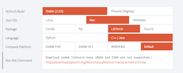
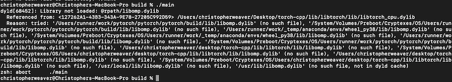
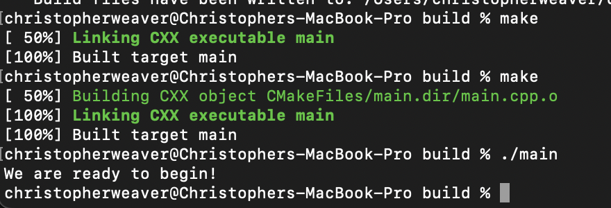
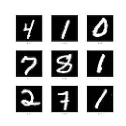
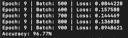

### Introduction
Python is the undisputed champion of machine learning, and for good reason. Its simple syntax allows people from various professions to quickly master it for their specific use cases. As a scripting language, Python facilitates rapid iteration of code blocks in Jupyter Notebooks. Although it's slow, Python boasts an array of powerful libraries that leverage C and C++ for heavy computation behind the scenes.

So, why consider C++ for building and training artificial neural networks when Python is such a natural choice? In some scenarios, performance and portability requirements render the Python interpreter impractical. For instance, Python is not well-suited for low-latency, high-performance, or multithreaded environments, such as video games or production servers. Additionally, deploying AI on edge devices poses significant challenges due to the intensive memory and compute resources required by deep learning models and the constraints of edge devices. A robot powered by reinforcement learning may handle the computational demands of its models, but mobile robotics often face limitations such as restricted battery power and the need to minimize computational use. While C++ does not entirely solve these issues, it does help mitigate them.

### Installation 
We will be using LibTorch C++ for this project. It is a C++ frontend that uses the same engine as PyTorch does for Python. This is great for those who know PyTorch as things look very similar between the two. Please be aware this is not a tutorial on training neural networks, simply how to train them in pure C++.

First thing we need to do is setup our project and ensure we have all the libraries we need. I will be doing everything on my m1 macbook pro, so some steps will be different for different machines. I start by creating a new directory, creating my main.cpp file, my lib directory, my cmakelists.txt, and my build directory. 
```bash
touch torch-cpp
cd torch-cpp
touch main.cpp
mkdir lib
touch CMakeLists.txt
mkdir build
```
Now we need to get the LibTorch C++ library into our project. Go to this [link](https://pytorch.org) and pick all the criteria for your machine (be sure you are picking LibTorch and C++/Java). If you have a device that supports CUDA, be sure and pick that one for faster training. Download using the provided link and store the download in your lib directory within the project. 



Next we need to setup our CMakeLists.txt. If you are not familiar with CMake, it is a popular build system for C++ that will help us easily pull in the LibTorch library into our project for use. You can find out more, including how to install CMAke it on your machine [here](https://cmake.org/getting-started/). This is what my CMakeLists.txt file ended up looking like:
```C
cmake_minimum_required(VERSION 3.18 FATAL_ERROR)
project(main)

set(CMAKE_OSX_ARCHITECTURES "arm64")

find_package(Torch REQUIRED PATHS ${CMAKE_CURRENT_SOURCE_DIR}/lib/libtorch/)
message(STATUS "Torch libraries: ${TORCH_LIBRARIES}")

set(RPATH ${CMAKE_CURRENT_SOURCE_DIR}/lib)
list(APPEND CMAKE_BUILD_RPATH ${RPATH})
message(STATUS "libomp found: ${RPATH}")

find_package(Threads REQUIRED)

include_directories(${TORCH_INCLUDE_DIRS})
link_directories(${TORCH_LIBRARY_DIRS})

add_executable(main main.cpp)

target_include_directories(main PRIVATE ./lib)
target_link_libraries(main "${TORCH_LIBRARIES}" "${CMAKE_THREAD_LIBS_INIT}")
target_compile_features(main PUBLIC cxx_std_17)  # Ensures C++17

if(TORCH_CUDA_VERSION)
    message(STATUS "CUDA Version: ${TORCH_CUDA_VERSION}")
    add_definitions(-DUSE_CUDA)
endif()
```
A couple things worth noting. Personally, I like to bring all my libaries physically into my project which is why we initially downloaded the libtorch into the lib directory in our project. That means I need to tell CMake where to find this library: find_package(Torch REQUIRED PATHS ${CMAKE_CURRENT_SOURCE_DIR}/lib/libtorch/)

Secondly, I ran into an issue with the LibTorch library running on my mac. C++ kept complaining it could not find the libomp library and would crash at runtime. 



I am not entirely sure what is up with that, but I knew I had that library in HomeBrew on my mac, so I just made a copy of the libomp.dylib and added it to my lib directory. I then direct Cmake to link all libraries in that directory so that it successfully gets pulled in. Problem solved. Also, I know I will not have CUDA on my machine, but I did decide to put in some extra checking in my CMakeLists.txt just in case it might be helpful for someone else. 

Now lets quickly add some code to our main.cpp file to ensure we are ready to start building. I initialize a simple Tensor to ensure we play nice with LibTorch
```C++
#include <iostream>
#include <torch/torch.h>

int main() {

    torch::Tensor foo = torch::rand({12, 12});

    std::cout << "We are ready to begin!" << std::endl;

    return 0;
}
```
In my terminal I next run
```bash
cd build
cmake .. 
make
./main
```
If everything is setup correctly, you should successfully have an executable called main compiled to your build directory. When we run it "./main" we should see "We are ready to begin!" printing to your terminal!



### Getting our database
We will be training our model to recognize images of handwritten digits between 0-9. This is called the MNIST dataset



We actually will need four different ubyte files representing the train images, test images, train labels, and test labels. In my project I added a new directory called mnist_data where these files will live. I then added this python script to that directory to download those files (the site these files are served from is notorious for returning 503 errors, if you get this, keep running the script and it will eventually work) 
```Python
import requests
import os

def download_file(url, filename):
    """ Helper function to download a file from a URL to the specified filename """
    response = requests.get(url)
    response.raise_for_status()  # Check that the request was successful
    
    with open(filename, 'wb') as f:
        f.write(response.content)
    print(f"Downloaded {filename}")

def download_mnist_ubyte():
    """ Download the MNIST dataset in UBYTE format """
    base_url = "http://yann.lecun.com/exdb/mnist/"
    files = [
        "train-images-idx3-ubyte.gz",
        "train-labels-idx1-ubyte.gz",
        "t10k-images-idx3-ubyte.gz",
        "t10k-labels-idx1-ubyte.gz"
    ]
    
    for file in files:
        url = f"{base_url}{file}"
        download_file(url, file)

# Run the function to download the dataset
download_mnist_ubyte()
```
This script will download the files into our mnist_data directory. The last thing you will need to do is extract the four files and we are good to go. 

### Lets get to the C++
We are now ready to start writing our C++ code to setup are model architecture, load up our data, and train it to classify these images. First we are going to build out our model. 
```C++
// Define a new Module. Inhereit from the torch nn module
struct Dense_Net : torch::nn::Module {
  
    Dense_Net() {
        // Construct and register two Linear submodules.
        fc1 = register_module("fc1", torch::nn::Linear(784, 350));
        fc2 = register_module("fc2", torch::nn::Linear(350, 75));
        fc3 = register_module("fc3", torch::nn::Linear(75, 10));
    }

    // Implement the Net's algorithm.
    torch::Tensor forward(torch::Tensor x) {
        x = torch::relu(fc1->forward(x.reshape({x.size(0), 784})));
        x = torch::dropout(x, /*p=*/0.5, /*train=*/is_training());
        x = torch::relu(fc2->forward(x));
        x = torch::log_softmax(fc3->forward(x), /*dim=*/1);
        return x;
    }

    // Use one of many "standard library" modules.
    torch::nn::Linear fc1{nullptr}, fc2{nullptr}, fc3{nullptr};
};
```
So what are doing here is defining out model as a C++ struct that inherits from the torch nn module. It appears we have to use a struct instead of a class otherwise torch complains the parameters member function we need to access later is private. Our model will be comprised of three linear layers of type torch::nn::Linear. When initializing our struct, we assign to each layer the size of the input coming into it and the size of the output coming from it. We also need to register the module with LibTorch. Finally we need to define our forward function. The forward function needs to take a torch::Tensor and will continously modify that Tensor as it executes the function. We call forward on each layer of our model, passing in the tensor, and then we apply the relu activitation function upon the result from that forward operation. On the final layer, we will apply to log_softmax function as a way to obtain the model classification prediction. 

Next we will move to our main() function and work on loading up our dataset for training. Luckily for us, the LibTorch library has some specialized features for working with the MNIST dataset specifically. 

```C++
int main() {

    auto dataset = torch::data::datasets::MNIST("../mnist_data")
                    .map(torch::data::transforms::Normalize<>(0.1307, 0.3081))
                    .map(torch::data::transforms::Stack<>());

    auto data_loader = torch::data::make_data_loader(std::move(dataset),torch::data::DataLoaderOptions().batch_size(64));

}
```
The first thing we are doing is loading our dataset. We tell torch where to find the MNIST dataset and to then normalize each image and to store the entirety as a stack. There are many more things we can do to help pre-process our dataset prior to training, but this is all we really need for this use case. 

Next we need to create a dataloader that will batch our data in mini-batches of 64 per examples training iteration. This will help speed up training and help the model generalize what it is learning. Once our data_loader is ready, we can now begin training
```C++
  // Initialize our model
  auto net = std::make_shared<Dense_Net>();

  // Set up an optimizer.
  torch::optim::Adam optimizer(net->parameters(), /*lr=*/0.01);

  // Iterate over the amount of epochs you want to train your data for
  for (size_t epoch = 0; epoch != 10; ++epoch) {

    size_t batch_index = 0;

    // Iterate the data loader to yield batches from the dataset.
    for (auto& batch : *data_loader) {

      // Reset gradients.
      optimizer.zero_grad();

      // Execute the model on the input data.
      torch::Tensor prediction = net->forward(batch.data);

      // Compute a loss value to judge the prediction of our model.
      torch::Tensor loss = torch::nll_loss(prediction, batch.target);

      // Compute gradients of the loss w.r.t. the parameters of our model.
      loss.backward();

      // Update the parameters based on the calculated gradients.
      optimizer.step();

      // Output the loss every 100 batches.
      if (++batch_index % 100 == 0) {
          std::cout << "Epoch: " << epoch << " | Batch: " << batch_index
               << " | Loss: " << loss.item<float>() << std::endl;
      }
    }
  }
```
There's a lot to unpack here, but for those familiar with using PyTorch in Python, this will all seem quite familiar. The comments provided should help clarify things. As we iterate over the data loader, we receive a mini-batch of 64 images from the MNIST dataset. The neural network executes this mini-batch, and then backpropagation is performed as part of the learning process. We log progress to the terminal after every 100 mini-batches processed.

Once training is complete, we assess the effectiveness of our model by testing it against the test dataset, which it has not yet seen. This is an excellent opportunity to determine if our model has truly learned to generalize digit recognition or has merely learned to classify the specific images from the training dataset.

Just like before, we load up a dataset and dataloader, although this time for our test dataset
```C++
    // Create the test dataset
    auto test_dataset = torch::data::datasets::MNIST("../mnist_data", torch::data::datasets::MNIST::Mode::kTest)
        .map(torch::data::transforms::Normalize<>(0.1307, 0.3081))  // Normalize data
        .map(torch::data::transforms::Stack<>());  // Stack data into a single tensor

    // Create a data loader for the test dataset
    auto test_loader = torch::data::make_data_loader(
        std::move(test_dataset),
        torch::data::DataLoaderOptions());
```
This should look nearly identical to when we loaded our train dataset except that we pass the parameter torch::data::datasets::MNIST::Mode::kTest which tells torch to load up the correct one. 

Next we setup our model to eval() mode and iterate over the test dataset, evaluating the accuracy of its output against the test training labels
```C++
net->eval();

    int correct = 0;  // Count of correct predictions
    int total = 0;    // Total number of samples processed

    // Iterate over the test dataset
    for (auto& batch : *test_loader) {
        auto data = batch.data;   // Features (input images)
        auto targets = batch.target.squeeze(); // Targets (true labels)

        // Forward pass to get the output from the model
        auto output = net->forward(data);

        // Get the predictions by finding the index of the max log-probability
        auto pred = output.argmax(1);

        // Compare predictions with true labels
        correct += pred.eq(targets).sum().item<int64_t>();
        total += data.size(0);  // Increment total by the batch size
    }

    // Calculate accuracy
    double accuracy = static_cast<double>(correct) / total;
    std::cout << "Accuracy: " << accuracy * 100.0 << "%" << std::endl;
```
I was able to get an accuracy of 96% after 10 epochs of training on this model, not bad considering its a simple dense neural network. 



There are better results to be had though if we instead utilize a convolutional neural network which specializes in vision tasks. We can easily cook one up
```C++
struct Conv_Net : torch::nn::Module {
    public:
        Conv_Net()
            : conv1(torch::nn::Conv2dOptions(1, 16, 3)), // input channels, output channels, kernel size=3
            conv2(torch::nn::Conv2dOptions(16, 32, 3)),
            fc1(800, 128), // Adjusted to 500 based on the calculation
            fc2(128, 10)
        {
            register_module("conv1", conv1);
            register_module("conv2", conv2);
            register_module("fc1", fc1);
            register_module("fc2", fc2);
        }

        torch::Tensor forward(torch::Tensor x) {
            x = torch::relu(torch::max_pool2d(conv1->forward(x), 2)); // pool kernel size=2
            x = torch::relu(torch::max_pool2d(conv2->forward(x), 2)); // pool kernel size=2
            x = x.view({-1, 800}); // Flatten to 800 features for fc1
            x = torch::relu(fc1->forward(x));
            x = fc2->forward(x);
            return torch::log_softmax(x, 1);
        }

    private:
        torch::nn::Conv2d conv1, conv2;
        torch::nn::Linear fc1, fc2;
};
```
My convolution model has two convolutional layers, two maxpool layers and two dense layers to reduce our output down to the 10 final values we can do a softmax on. We also need to flatten the tensor coming out of the last maxpool layer into the type of a one dimensional tensor our dense layers can take. Training this for 5 epochs got us up to 98.6%

Alright, now that our model is perfoming well, we probably want to save it for use later
```C++
torch::save(net, "net.pt");
```

And finally, loading up the model
```C++
torch::load(net, "net.pt"); 
```

### Unlocking the power of the GPU
Modern deep learning is powered by GPU's and other hardware specialized for the types of linear algebra these models execute en masse. Luckily, the TorchLib C++ library supports training our models on CUDA powered gps's right out of the box. This of course wont work on my macbook which does not run on a NVIDIA gpu with CUDA on it, but I was able to test and confirm what I have below does work on my linux machine that does have the hardware for this. Assuming you have the correct version of CUDA for the LibTorch library you installed (for me I am using Cuda 12.4 with libtorch 2.3.0), all we need to do is change a few lines in our C++ file. After we initialize our model, we check to see if our machine has a compatible verison of CUDA on it, if so we initailize a torch::Device object that is defaulted to the cpu, but can be changed to a gpu if the conditional check passes
```C++
torch::Device device(torch::kCPU);
if (torch::cuda::is_available()) {
  device = torch::Device(torch::kCUDA);
}
```
Now, all we need to do is ensure our model and the data it will be interacting with is properly moved to this device (hopefully our GPU). Three lines need to reflect this change:
```C++
net->to(device);
auto data = batch.data.to(device);
auto targets = batch.target.to(device);
```
That is it. With this change our model should successfully train on our GPU. The good news is, even if we do not have a compatible GPU, this code will still work fine since we default to the cpu. Our updated code will look like this:
```C++
// setup our device contingent upon the machine we are training on
 torch::Device device(torch::kCPU);
 if (torch::cuda::is_available()) {
   device = torch::Device(torch::kCUDA);
 }

 // Initialize our model
  auto net = std::make_shared<Dense_Net>();
  net->to(device);

  // Set up an optimizer.
  torch::optim::Adam optimizer(net->parameters(), /*lr=*/0.01);

  // Iterate over the amount of epochs you want to train your data for
  for (size_t epoch = 0; epoch != 10; ++epoch) {

    size_t batch_index = 0;

    // Iterate the data loader to yield batches from the dataset.
    for (auto& batch : *data_loader) {
      
      // ensure our data is on the gpu or cpu depending on our machine
      auto data = batch.data.to(device);
      auto targets = batch.target.to(device);

      // Reset gradients.
      optimizer.zero_grad();

      // Execute the model on the input data.
      torch::Tensor prediction = net->forward(data);

      // Compute a loss value to judge the prediction of our model.
      torch::Tensor loss = torch::nll_loss(prediction, targets);

      // Compute gradients of the loss w.r.t. the parameters of our model.
      loss.backward();

      // Update the parameters based on the calculated gradients.
      optimizer.step();

      // Output the loss every 100 batches.
      if (++batch_index % 100 == 0) {
          std::cout << "Epoch: " << epoch << " | Batch: " << batch_index
               << " | Loss: " << loss.item<float>() << std::endl;
      }
    }
  }
```
If you successfully do get this to train our your gpu, you should see a significant speedup in training time (especially for the convolutional neural network). 

Please do heed my warning that getting CUDA to work on your machine for deep learning is not for the faint of heart. There is no simple process to get that up and running, even when you do have the correct hardware. Previous to writing this post, I was running CUDA 10 on my linux machine, which was not compatible with libtorch, and it took me a good couple of hours to struggle my way through removing CUDA 10 and then installing CUDA 12. 

### Conclusion
There are thousands of tutorials available that teach how to train a neural network to accurately classify the MNIST dataset using Python. This popularity is well-founded, as Python offers an impressive array of tools for this purpose. However, there's an emerging need for edge devices that can harness the power of these neural networks. Using C++ for such applications provides the efficiency and low memory footprint that these devices critically require. As we move forward, it's likely that developers will increasingly turn to C++ to meet the stringent performance demands of edge computing environments.