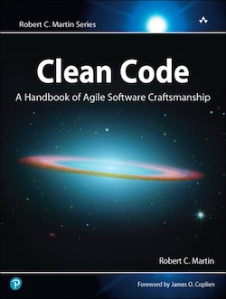
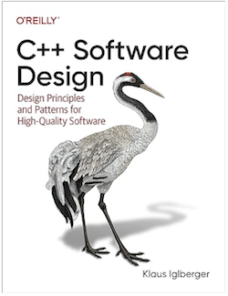

Rust represents a paradigm shift in software engineering. For decades, engineers have had to choose between performance and the flexibility to modify software easily. The optimizations used to squeeze every last cycle out of a program often came at the cost of added complexity in the codebase. This is partly due to the nature of optimization itself, which requires focusing on specific aspects of a program’s behavior to tailor performance to that narrow area.

Such optimizations almost always sacrifice more generic, flexible solutions—solutions that engineers can more easily understand and modify. While speed is crucial in software engineering, software is constantly evolving. The ability to change a program confidently relies on proper design patterns that decouple dependencies and structure code in a way that’s easy to reason about.

There’s no shortage of books that emphasize the importance of clean code and effective software design. Among those I’ve read, I highly recommend:

***Clean Code***

**Author:** *Robert Martin*



***C++ Software Design***

**Author:** *Klaus Iglberger*



An area of heavy study for me is how to best apply many of the most useful design patterns in C++ without the unacceptable tradeoffs in performance that usually requires the use of C++ to begin with. The std::variant for the visitor design pattern, compile time type erasure, are among some of the patterns I usually attempt to leverage because they offer both excellent run time performance and readily adhere to the benefits of clean code. But C++ is a massive and complex language with a million and one ways to accidentally cede away performance in an attempt to design clean, flexible software. 

This is where Rust comes in. Rust promises the performance of C++ without the plethora of design patterns meant to tame the language into something that is manageable. Rust came onto the scene in 2015 and stood on the shoulders of giants. It had the massive advantage of learning all the lessons C++ provided as it attempted to adapt to the programming paradigm shifts of the past 40 years. Rust takes the benefits of object oriented development but without things like inheritance. It adopts many of the best aspects of functional programming and makes them first class citizens within the language. All this means Rust allows for cleaner code with less sacrifice required to your programs performance. Rust still suppports most of the classic design patterns in some [fashion](https://rust-unofficial.github.io/patterns/patterns/index.html), but they are dramatically tamed down compared to what you will see in lanaguages like Java and C++. They often are significantly less needed. Rust encourages clean code with orthagonal pieces out of the box. It makes the sea of objects that quickly become dependencies within each other hard to create and instead nudges users toward better software design. 

Rust can be expressive, which means we humans still have the ability to write really bad Rust code. Despite all the ways Rust discourages this behavior, it is possible. Adherence to some of the following guidelines keeps code cleaner, easier to reason about, and more robust. But first, we are well served to better define clean code. Clean code can be conceptualized by five key principles:

1) Readability: Code should be self-explanatory.
2) Simplicity: Avoid unnecessary complexity
3) Maintainability: Code should be easy to modify. 
4) Efficiency: Code needs to be efficient enough to meet the needs it was written for
5) Idiomatic: Each programming language comes with its own idiosyncrasies that the community has crafted best practices to combat

Lets explore each of these, one at a time and go over some ways to help Rust meet these principles. 

***Readability***
Most of us who have been doing software engineering long enough have had to suffer through many code bases where variable names are not readily meaningful. 
```Rust
let x = 25;
fn process(a: f64) -> f64 { a + 1.0 }
```
What does x mean within the broader context of the control flow of the program? Process? What are we processing? Also, if our process function is complex enough, attempting to reason about what 'a' is quickly becomes confusing in itself. None of these variable names are helpful to anyone who might later need to jump into the code and understand what is happening. At best, it will take the engineer significantly longer to understand what is happening. But another likely outcome is bugs will be introduced due to a slight misunderstand of the nature of these variables and function names. Perhaps even more frustrating is the use of abbreviated variable names to save on developer keystrokes and to "increase readability".
```Python
def random_function(sn, vb):
        do_some_stuff()
```
I see this constantly. These variables were given names that are functionally significant, but were abbreviated to the point that they are not obvious. Here sn likely means serial number, and vb verbose, since these are generally used as shorthand for these terms. But why must I guess this? Is the developer really saving that much time to type sn instead of serial_number? The answer is absolutely not. Will the verbosity of longer variable names make the code less readable? Again, no. It might make it look less pretty at first glance, but fully typed out coherent names will allow for significantly better code that others can quickly reason about. 

Rust offers an amazing form of code documenting that needs to be highly utilized by everyone who programs with the language. When it comes to readability, the code itself should explain what it does. This is the exact reason why we have programming languages on top of machine code, to make the control flow of these programs more human readable. But even when we write good code that explains what it does, we still should be adding comments that explain WHY some piece of code exists. Good code has lots of interconnected orthagonal pieces that need to come together into a symphony of functionality. Comments help us reason about each individual piece at a higher level of context. Rust also offers rustdocs, which empowers cargo to locate all comments with three backshlashes /// and turns it into an easily digestable html docment. This means you can manage code comments and documentation all from one central location! Furthermore, you can easily add tests into your code comments that cargo will automatically extract and run when testing your code. Advocates of Test Driven Development have long argued that tests are a great way to explain the purpose of code and act as a form of code documentation. Rust integrates this altogether into one place for clean, easily readable code. 

***Simplicity***
One of the most pervisive acronyms within software development is SOLID. Generally applicable to heavily object oriented programming, the S, standing for single responsibility has applicability in Rust as well. Functions should be limited in what they do to both to allow for easier reasoning about in the code (at least if functions are properly named) but also to make each function more reusable throughout the code. A function to process data that both filters an array and then sorts the array is a function that might be too complex and lacks the simplicity to be reusable throughout the codebase
```Rust
fn process_data(data: Vec<i8>) -> Vec<i8> {
    let filtered: Vec<i32> = data.into_iter().filter(|&x| x > 0).collect();
    filtered.into_iter().sorted().collect();
}
```
Seperating this into distinct parts better conforms to the single responsibility principle
```Rust
fn filter_data(data: Vec<i8>) -> Vec<i8> {
    data.into_iter().filter(|&x| x > 0).collect();
}
fn sort_data(data:Vec<i8>) -> Vec<i8> {
    data.into_iter().sorted().collect();
}
```
The above is actually a very bad example, since we can use zero cost iterators to do that all in one swoop in a much more readable way, but what I display above presents the fundamental idea of what is being asked of developers. 

***Maintainability***
The issue with being able to modify code can be broken down into two sub-issues:
1) Can you reason about the code sufficiently to change it
2) Can you modify the code without breaking other parts of your software you did not expect to be related

Rust has the best type system I have every come across in a programming language. It is sufficiently stricter than what dynamic languages like Python and JavaScript offer. Even C++, because of its large amount of implicit behavior, lacks the definitive type system Rust offers out of the box. But Rust also offers an incredible level of flexibility within its type system in the form of algebraic sum types. Rust enums can store different types of data based on the case that can be pattern matched at runtime. Bringing together both the unique strictness and flexibility of the Rust type system allows us to take bad code like this
```Rust
fn handle_response(code: i32) {
    if code == 200 {
        // Do success code
    } else if code == 404 {
        // Do not found code
    } else {
        // Do unknown error code
    }
}
```
and turn it into something more type safe
```Rust
enum HTTPStatus {
    Success,
    NotFound,
    Unknown
}
fn handle_response(code: HttpStatus) {
    match code {
        HTTPStatus::Success => // Do success code ,
        HTTPStatus::NotFound => // Do not found code ,
        HTTPStatus::Unknown => // Do unknown error code,
    }
}
```
Leveraging Rusts strong type system allows for more expressive programming that is easier for others to see what exactly you are doing, but it also catches lots of mistakes. In the first example, if you accidentally type 405 instead of 404, your program will successfully compile and run, but the results are hard to predict (and could be disastrous). But a typo in the second example will be caught during compile time and disaster will be averted. Rusts type system, when used to its full potential, means we can make code changes quicker and sleep more soundly at night. 

Maintainable code is also code that properly handles the reality that errors outside the control of the engineer are bound to happen during runtime. It could be a network issue, or perhaps the machine you are running on fails to read from disk, or the user inputs incorrect data. All these things are outside the control of the software engineer, but they need to be handled. Most other languages offer, amongst many different options, the ability to throw exceptions when these errors occur. Exceptions are a controversial subject within the software development community. They are often hard to reason about and for languages like C++ incur a non-determinstic runtime penalty when utilized. Perhaps most importantly, it is often difficult to reason about the control flow of a program that throws exceptions. If a function throws an exception, which part of your program will take ownership of the control flow? What happens to all the resources that were allocated prior to the error being thrown? How far will the error get propogated?

Rust takes a different approach. It does not support exceptions, but instead requires code that might experience errors to explicitly work with a Result<, Error> enum. This is nice because we get a determinstic runtime approach ideal for systems programming. But for the purposes of maintainability, it is really nice because it means we can clearly see all the places error might occur and the compiler requires us to explicitly deal with them as they arise
```Rust
fn divide(a: i32, b: i32) -> Result<i32, String> {
    if b == 0 {
        Err("Division by zero".to_string())
    } else {
        Ok(a / b)
    }
}

let divide_result = match divide(12, 6) {
    Ok(answer) => answer,
    Err(error) => 0,
}
```
Here we can see that the return value of our divide function is a result, which is an immediate heuristric to us that this function might return an error of some kind. The fact that this is listed in the function signature means we can much more quickly reason about our code which is a major contributor to maintainability. But also, Rust requires that we deal with the Result enum if we want to work with this value. Pattern matching the Result provides a clean, idiomatic way to handle errors across the entirety of our program. 

Writing tests can be a massive pain in many ecosystems. Often, seperate libraries need to get incorporated into the build system that allow for the types of testing large projects require. But the reality is, a system without tests is a system you cannot reliably maintain. Tests allow engineers to make changes and ensure those changes do not have unanticipated consequences elsewhere in the system. This safety mechanism allows for quicker iteration and a system that is overall more maintainable. 

Rust offers first class testing right out of the box with cargo
```Rust
// src/main.rs
pub struct Calculator;

impl Calculator {
    pub fn add(a: i32, b: i32) -> i32 {
        a + b
    }

    pub fn subtract(a: i32, b: i32) -> i32 {
        a - b
    }

    pub fn multiply(a: i32, b: i32) -> i32 {
        a * b
    }

    pub fn divide(a: i32, b: i32) -> Result<i32, String> {
        if b == 0 {
            Err(String::from("Cannot divide by zero"))
        } else {
            Ok(a / b)
        }
    }
}

fn main() {
    println!("5 + 3 = {}", Calculator::add(5, 3));
    println!("10 - 4 = {}", Calculator::subtract(10, 4));
    println!("6 * 7 = {}", Calculator::multiply(6, 7));
    match Calculator::divide(20, 4) {
        Ok(result) => println!("20 / 4 = {}", result),
        Err(e) => println!("Error: {}", e),
    }
}

// src/lib.rs (for tests)
#[cfg(test)]
mod tests {
    use super::*;

    #[test]
    fn test_add() {
        assert_eq!(Calculator::add(2, 3), 5);
    }

    #[test]
    fn test_subtract() {
        assert_eq!(Calculator::subtract(10, 4), 6);
    }

    #[test]
    fn test_multiply() {
        assert_eq!(Calculator::multiply(3, 7), 21);
    }

    #[test]
    fn test_divide() {
        assert_eq!(Calculator::divide(20, 4).unwrap(), 5);
    }

    #[test]
    fn test_divide_by_zero() {
        assert!(Calculator::divide(10, 0).is_err());
    }
}
```
The #[test] macro allows developers to run 'cargo test' to quickly have all the written test run to confirm the system is operating as it should. Test can easily live within the same file as the code they are testing and, as mentioned above, can be integrated into the code documentation as well. With the ease in which tests can be written into a project in Rust, developers no longer have an excuse not to utilize these to their full potention. 

***Efficiency***
Rust carves out its niche as a systems programming language that offers comparable speed to C/C++ but with additional safety guarantees and without all the technical baggage these other older langauges had accumulated over the years. This does not mean Rust cannot be written in a way that runs painfully slow, but only that it offers the ability to execute top tier performance other languages like Python and Java cannot match. Taking advantage of this speed involves keeping as much in stack memory as possible
``` Rust
struct Car {
    // Car stuff
};

let car = Box::new(Car); // Bad, stay away from heap memory if you can

let other_car = Car(); // Better, this is stack allocated and will likely be significantly faster
```
and avoiding deep copies of large data structures through the usage of references. References are memory pointers that allow your code to pass the memory address of a resources to other parts of your code quickly and efficiently
```Rust
fn process_data(data: &Vec<i32>) {
    // Do something with data
}
let data: Vec<i32> = Vec::new();
process_data(&data);
```
No data gets copied. Only a 64 bit pointer gets passed to the function which can now use the data vector to do its thing. This has historically been a pain point for langauges like C++ which use these techniques for efficiency, but then struggle to cope with what modifications might be happening to these data objects as they get passed around. Rust solves this by not allowing modifications to references by default, essentially putting the resources into read only mode as long as a reference to it exists somewhere. You can pass a reference elsewhere that is mutable, but the compiler will ensure this mutable reference only exists in one place at a time during the lifetime of your program. 

Rust also offers zero cost iterators that lazily do work over data structures like vectors to efficiently handle the same kinds of tasks engineers have historically used For Loops to solve. 
``` Rust
let numbers = vec![1, 2, 3, 4, 5];
let doubled: Vec<i32> = numbers.iter().map(|x| x * 2).collect();
```
The second line here gets a new vector where each value from the numbers vector has been doubled. We can chain lots of these iterators together to form some really cool and complex behavior. These iterators do not make unecessary copies of data and only operate lazily on elements as necessary, which makes them very performant. They also provide for features that are significantly easier to reason about than custom for loops which can be challenging to understand and are very error prone. 

Using pattern matching and enums to handle different types of data also provides excellent optimizations techniques relative to dynamic polymorphism which is the go to method in other languages to match functionality. A classic C++ example
```C++
class Animal {
    virtual void make_noise() = 0;
}
class Dog: public Animal {
    override void make_noise { std:: cout << "Bark"; }
}
class Cat: public Animal {
    override void make_noise { std::count << "Meow"; }
}
void main() {
    Animal animal1 = new Dog();
    Animal animal2 = new Cat();
    Vector<Animal> v;
    v.push_back(animal1);
    v.push_back(animal2);
    for (animal : v) {
        animal.make_noise();
    }
}
```
This program works really well. We have a list of generic animals. Despite the fact that each animal in the vector is distinct, they share a common interface which means we can generically call make_noise on each animal and get the custom behavior we expect depending on the actual type of animal we have. The problem is, this type of dynamic polymorphism comes with runtime costs since the program needs to navigate through multiple pointers to different places in memory. 

Rust handles this differently with enums:
```Rust
enum Animal {
    Dog,
    Cat,
}

impl Animal {
    pub fn make_noise(&self) {
        match self {
            Animal::Dog => println!("Woof!"),
            Animal::Cat => println!("Meow!"),
        }
    }
}

fn main() {
    let animals = vec![Animal::Dog, Animal::Cat, Animal::Dog];

    for animal in &animals {
        animal.make_noise();
    }
}
```
We have similar functionality, but with what is likely much better runtime performance. There is no heap indirection, but instead tightly packed enum types that the compiler will likely be able to optimize and inline much of the functionality for. C++ and other languages can provide similar functionality using std::variant and the std::visit function. But Rust offers a superior level of optimization here and this all lives as a first class citizen in the language. Use these algebraic sum types and pattern matching often in Rust. It is clean, and it is efficient. 

***Idiomatic***
Idiomatic Rust code follows best practices that have been discovered and affirmed over time by the community. These practices tend to offer excellent runtime performance and cleaner code that other developers can quickly reason about and understand. Things such as pattern matching, Results, and Options are out of the box solutions that can improve a code base significantly if properly utilized. Traits and Generics are another idiomatic feature of the language that provides a powerful tool for DRY, easily understandable code. Want a way to easily print your car object?
```Rust
struct Car {
    model: String,
}
impl Printable or Car {
    fn print(&self) {
        println!("Value: {}", self.model);
    }
}
fn main() {
    let car = Car{"Honda"};
    car.print();
}
```
We have just easily extended our car object with a new trait. This aligns well with the Open-Closed principle (the O in SOLID) which states we should allow for classes to be extended with new functionality without modifying the class itself. But even better, we can utilize generics to handle our Car class without duplication of code
```Rust
fn print_value<T: Printable>(value: T) {
    value.print();
}
fn main() {
    let car = Car{"Honda"};
    print_value(car);
}
```
The print_value function has no idea what a Car struct is, nor does it care. All it needs to know is that it is being passed something that implements the Printable trait and therefore has the print() function that it can call. 

Generics and traits are two extremely useful idiomatic tools Rust offers for clean, robust software without any compromise to our runtime performance. 