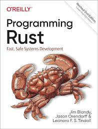

### C++ - Cracks in the Foundation
A prominent topic at CppCon 2024 was a recently published [study](https://media.defense.gov/2022/Nov/10/2003112742/-1/-1/0/CSI_SOFTWARE_MEMORY_SAFETY.PDF) by the NSA emphasizing the importance of memory safety and recommending a quick migration from memory unsafe languages like C/C++ to other languages such as Rust for all mission critical software. Proponents of C++ argue that the concern is overblown and modern C++ offers all the tools needed to write robust, memory safe software. But despite the reassurance from the likes of those like [Bjorne Stroustrup](https://www.open-std.org/jtc1/sc22/wg21/docs/papers/2023/p2739r0.pdf), many remain unconvinced. 

This had me thinking about my own recent concerns over C++ and how these concerns have changed my thinking. The first thing that really started to make me re-evaluate the language was a recent example I came across involving [implicit conversions](https://groups.google.com/a/chromium.org/g/chromium-dev/c/EUqoIz2iFU4/m/kPZ5ZK0K3gEJ). This organization discovered that chrome was making 25,000 memory allocations per keystroke while using their application. This massive hit on their apps performance was the result of code that looked like this
```C++
    char *c_string = "Memory allocation incoming";
    std::string str = c_string;
```
To those who are not entirely in the know about the underlying mechanics of std::string, the presumption might have been that passing a heap allocated array of chars to a std::string that owns a single heap allocated array of chars would result in the string taking ownership over the heap resource. But this was not so. Instead, std::string allocates a new array on the heap and copies each char value over to this new array. The code above does an implicit memory allocation each time we make an assignment like this. To the seasoned C++ developer, this may be well known. It may also be desirable since a deep copy of the heap array means the std::string has full ownership of the underlying data and does not have to worry about it being modified or deleted elsewhere. But C++ is bountiful with the amount of implicit behavior like this happening under the hood, and its this implicit behavior that can cause both unexpected and undesired outcomes. 

The second strange thing I recently came across was this gem:
```C++
#include <iostream>

int main() {
    for(;;);
}

void go_home_c_plus_plus_you_are_drunk() {
    std::cout << "lol" << std::end;
}
```
Run this simple program on your machine and you might see 'lol' display on your console despite the fact that the function to write those characters to the console is never called. You see in C++, an infinite loop is considered *undefined behavior*, and the compiler is free to do whatever it wants when face to face with such examples. Anything is possible, and the end result can be very hard to predict. It turns out in the example above, some compilers may decide to clean up the infinite loop in such a way that there is fall through to the next function body. The prospect that a systems programming language used to write so much of the worlds most critical software could so easily end up executing code that the developer never explicitly called to execute is wildly unacceptable. 

Implicit and undefined behavior has recently become a front and center issue for me and it had me open to exploring other options. C++ has been the industry standard for software that needs to reach the bleeding edge of speed and memory efficiency for decades, and so many of the promised C++ killers like Java and Go were entirely unacceptable as replacements where low level code is needed. Rust though, seemed to be different. It promised comparable speed to C and C++, but without so many of the drawbacks of those languages. I decided it was worth a little bit of my time to start learning. I started by picking up a copy of 

***Programming Rust***

**Author:** *Jim Blandy, Jason Orendorff, and Leonora Indall*



I was interested to see what made Rust one of the most beloved langauges amongst developers according to recent [surveys](https://survey.stackoverflow.co/2024/technology#2-programming-scripting-and-markup-languages). What I discovered was that **Rust was everything I wanted C++ to be**. The things I liked about C++ (compared to other langauges like Java and Python), Rust also had, but it just did it better. 

What follows is my list of some of the things I discovered that Rust does that I sorely wish C++ either did, or did as well as Rust. I will largely avoid discussing memory safety as it was something I was already aware of prior to reading the book, and its discussion is largely low hanging fruit when it comes to comparing Rust to C++.

1) True const correctness.
    I have read many proponents of C++ over the years speak to the langauges offerings for const correctness. Mark a variable const and rest well that it will not be modified througout the lifetime of the program. Similar const flags in function signatures offer additional assurance that return values and object methods will not modify values in our program that we wish to remain unchanged. But there are two major problems with the C++ approach to const correctness. The first is that it is not always easily clear what can be modified and what cannot. This function takes a const pointer and successfully modifies it
    ```C++
    void test_fn(int* const ptr2) {
        *ptr2 = 14;
    }
    ```
    This works and we have successfully modified the underlying value despite the const marking. This is because what is actually const in this function is the memory pointer. We cannot actually modify the pointer address, but the value the pointer holds an address for is fair game for modification. This will trip many a developer up who may not be aware the only way to really lock down this value is
    ```C++
     void test_fn(const int* const ptr2) {
        *ptr2 = 14; // compiler error, cant modify 
    }
    ```
    The second problem is that immutable values is something a C++ developer needs to opt-in to. This means by default all values are mutable and free game across the program.
    
     Rust takes a different approach, making all values immutable unless specifically marked as mutable
    ```Rust
    let test_var: u8 = 15;
    test_var = 42; // compiler error, test_var is not mutable

    let mut test_var2: u8 = 100;
    test_var2 = 200; // This is fine
    ```
    Even passing values into functions requires parameters be marked as mutable, otherwise they are presummed to by read only
    ```Rust
    fn test_fn(our_val: &u8) {
        out_val = 42; // Error, borrowed reference is not mutable
    }
    
    fn test_fn2(our_val: mut &u8) {
        out_val = 42; // This is fine
    }
    ```
    The state of any value within your program in Rust will never change unless the developer gives explicit permission to change. Both of these philosophies work, but the Rust approach is significantly better. And the reason goes to the heart of systems programming: predictability and control. Data that cannot change is more predictable than data that can change. It is highly likely a developer will forget to mark a value as const at some point in their career, a mistake that might not be discovered until a bug becomes known at runtime. With Rust, on the other hand, if a developer forgets to mark their values as mutable and attempts to modify it later in the program, this issue is caught at compile time well before anything gets shipped to production. This is a huge win.

2) Fixed primitive type sizes.
    What size is this value at runtime in C++?
    ```C++
    int v = 12;
    ```
    The answer is, we do not know. C++ does not promise a fixed bit width for most of its primitives. Instead, it leaves the int size up to the compiler implementation in congruence with the machine the code is being run on. Usually we can expect an int to be 4 bytes, but this is not guaranteed. The only way to know for sure is to ask the type for its size at runtime:
    ```C++
    std::cout << sizeof(int);
    ```
    This is inconveniant, particullarly for a language that needs to be compiled to run. Rust on the other hand offers explicit, fixed width primitives as the default. u8, i16, f64, are all basic number values you can expect to see in Rust where the precise size of the type is clear to anyone looking at the code. 

    Is it the end of the world that we have a better grasp of primitive types in Rust based on the source code alone compared to C++? Maybe not. Unless overflows are a concern, or you are attempting to squeeze every ounce of optimization out of your program possible. Then this information is really nice to have. 
    
    To be fair, C++ does offer fixed width primitive types ever since C++11. int8_t, uint32_t, etc are all readily available for the developer to use. The problem is they often feel like second class citizens within the lanuage itself with only modest adoption amonst the C++ community. They exist, and are great to use, but they are not the default standard found within their respective code base like what you will see with Rust. 

3) Less implicit behavior.
    Implicit behavior and conversions can lead to some nasty bugs. Accidentally assign your floating point value to an integer and the compiler will be all too happy to perform a narrowing conversion that leads to true data loss. Passing around an enum in C++ is famous for getting mixed with integers and a loss of important context to ensure robustness within the control flow of the program. I already mentioned earlier that many constructors like std::string engage in implicit behavior with the data assigned to it that may not be obvious to the developer and can lead to nasty performance degradation at runtime. 

    Rusts holds more true to an important philosphy crucial for successful high performance/systems programming:

    "One of Rust's principles is that costs should be apparent to the programmer. Basic operations must remain simple. Potentially expensive operations should be explicit"[^1]

    The quote above was speaking to Rusts move semantics, but I find this philosophy is well adhered to throughout the language. Implicit behavior oftens appears to be built into a language either due to technical debt or because the behavior was presummed to be conveniant and common sense. History has not always been so kind to that way of thinking. Explicit, predictable behavior sometimes requires more work and thinking from the developer, but the upfront costs on developer effort pays off with better formed programs that behave just the way we the engineer would want. 

4) Limited OOP.
    When I first began accumulating resources on C++ to better master the language, I found there was a lot of focus centered around design patterns. This in part is because the language has a large community with decades of accumulated experience on how best to build things with the language. But it also, in part, stems from the fact that C++ offers a dizzying amount of tools and features, a lot of which if used wrong will cause bugs, kill performance, or make the code unmanageable. 

    All languages have design patterns because design patterns are a good thing. But languages like Rust have significantly less. This, in part, is because the borrow checker keeps out all the memory errors and undefined behavior that a significant portion of C++ design patterns exist to stave off (I am looking at you RAII). But it also is due, in part, to the fact that Rust has a significantly paired down form of object oriented programming. It has C style structs, but unlike C++ these structs do not so easily give way to building constructors, destructors, and access modifiers. More importantly, Rust structs do not support inheritance. 

    Inheritance can quickly turn into a convoluted mess in one's source code. To address this challenge, design patterns and best practices have emerged en masse to help tame this fickle beast. But even where inheritance is used properly within a limited scope, the mental burden of keeping track of all the C++ objects and their inheritance family can be very unpleasant. C++ engineers often find themselves being subject experts in their user defined objects instead of the language mechanics itself. 

    Rust does not have inheritance. It has other tools to solve the types of problems inheritance was made to help with. But I would argue moving away from the 'sea of objects' heavy OOP lanuages tend to create is a major benefit.

5) No exceptions.
    Exceptions in C++ are a controvertial topic. Many C++ shops strictly forbid the use of exceptions in their source code because it introduces relativley huge and unpredictable run time penalties when thrown. Exceptions also violate the zero cost abstraction principle because handling exceptions introduces runtime overhead even in the absence of exceptions being used because the compiler needs to generate metadata and manage unwinding tables for potential exception handling. 

    Even worse, exceptions add significantly more mental overhead for developers who have to reason through what functionality might throw an exception, what they might throw, and what the implications are. Unfortunately, C++ functions do not require the developer to mark that a function might throw an exception, making it difficult for others to reason about the code. Instead, C++ has developers mark if an exception wont throw, again utilzing the opt-in approach to safety. 

    Rust does not have exceptions. A simple Result<_, error> enum takes its place where some function might experience an error. 
    ```Rust
    fn parse_version(header: &[u8]) -> Result<Version, &'static str> {
        match header.get(0) {
            None => Err("invalid header length"),
            Some(&1) => Ok(Version::Version1),
            Some(&2) => Ok(Version::Version2),
            Some(_) => Err("invalid version"),
        }
    }
    let version = parse_version(&[1, 2, 3, 4]);
    match version {
        Ok(v) => println!("working with version: {v:?}"),
        Err(e) => println!("error parsing header: {e:?}"),
    }
    ```
    The code above is clear within the function signature on its intent. It might error and the caller must always be prepared to handle that. There is no guessing if the function throws or not and we can easily predict how our function will perform in production regardless of the outcome. 

    Once again, my gripe with C++ is not only that it supports exceptions, but that function signatures do not have to be explicit about if it might throw an exception or not. Instead, developers are required to mark a function as noexcept if they want to communicate to the caller (and the compiler) that this function will not throw an exception. This is another form of opt-in safety that is prone to errors, difficult to reason about, and harms performance. There is a lack of clear and concise predictability within the source code. It would have been better if C++ required functions that throw to mark in their signature that they might throw.

6) A build system.
    Rust comes with cargo which helps developers quickly spin up a project and bring in any third party dependencies required to operate. I cannot even begin to overstate how huge of a win the cargo build system and dependency manager is for systems developers. The amount of times I have spent attempting to wire together all my source files and dependencies into an executable in C++ is mildly depressing. Even when things should be straight forward for me, linker errors are a continual challenge to overcome. 

    I suspect this might be the single greatest barrier of entry to new developers trying to learn and use C++. Spinning up anything other than a single main.cpp hello world project is non-intuitive, lacks standardization, and leaves one contemplating a new career as a beat farmer. 

    Having said that, one of the things I liked about managing dependencies in C++ is the granular control you have over it. Pulling in third party libraries into your local machine and linking them together means you have a better understanding of what exactly your code is linking to. One of the disadvantages to packages managers like Rust is that by asking for one library, cargo may be required to pull in a ton of other packages that your original one itself relies on. Binaries quickly become bloated with all these packages, many of which the developer is not immediately aware of. In systems programming, it is generally not a good idea to use third party software that has not been vetted. But in Rust, this is often too easy to do. 

    Fortunately, cargo does allow for developers to pull in their specific packages to their local machine and point to their file path for more granular control. You still get many of the same benefits of stiching everything together as you do in C++, but without all the complicated linker errors that come along with it. 

    Otherwise, cargo makes building complex projets with lots of files and dependencies a real joy. Targeting specific machine architectures, specifying dependency version numbers, and adding additional compiler flags are all simple and intuitive. Even when something goes wrong, Rust provides error messages that are vastly superior to what you will get with C++ build systems. 

7) A cohesive language.
    C++ was first introduced to the world in 1979. A lot has changed since then and the language has had to adapt to these changes. One of the more admirable things about C++ is its devotion to maintaining backward compatibility. The goal of ensuring code written 20 years ago still compiles and runs today is a huge win for a low level, systems critical, programming language. But the end result of a language that both needs to change and support older aspects of itself is a language reminiscient of Frankensteins monster. Many of the things that originally made sense in order to work as a superset of the C programming language, or to stay relevant with the era, have since been admitted by the community to be a feature worth avoiding. The preprocessors, null pointers, auto_ptr, among many other features of the language have fallen out of favor and are spoken of apologetically. But these items remain largely available for developers to use and they make for a langauge that feels a little of of sync with itself. C++ has made a commitment to legacy systems from a bygone era. This is an admirable goal, but one that will hamstring the language going forward. 

    Rust on the other hand is a new modern language. It has taken so many of the hard lessons learned over the past 30 years from multiple paradims in order to build a more cohesive experience for the developer. Unlike C++, all the parts that make up the language fit well together. Rust provides a superior developer experience, and I would argue that is important in a unique way. I have always been of the opinion that too many software engineers lean towards writing software that is concise on syntax in order to limit their keystrokes. This, they would argue, is provides for a better developer experience. But the cost of this 'superior' developer experience is software the is difficult for others to reason about in the future. This is not what I mean when I speak to a better devleoper experience. Instead, what I am speaking to relates more closely to the goal of programming langauges in general. Gone are the days or writting machine code on punch cards, or even assembly. We have abstracted that away to programming langauages that more closely represent natural human language. This means multiple developers can work on the same system more quickly. This is a good thing. Software exists because it allows for us to modify computer systems more cheaply than changing physical hardware. The invention of programming langauages helps make modifying software easier. Anything that leans toward that goal is a net benefit and should be spoken of as providing for a better developer experience.

    Rust offers a better developer experience in that it does not have a large set of tools that are deemed unacceptable by a large part of the community. It does not have features that feel like they have been duct taped on as an awkward later addition. There is no rule of 3 turned rule of 5. No macros that are compiler specific. Even C++'s fundamental features like new and delete are largely considered code smells to be avoided where possible within your source code. Rust is a clean slate. We can use this slate to build software faster and safer than ever before. 

### Conclusion
The world runs on C++ and it is not going anywhere. I have an affinity for the language and the types of problems C++ is leveraged to solve. They say sunlight is the best disinfectant, and C++ is in desperate need of help. I do not believe drastic changes to the language to fix some of these issues are welcome as they will only bring additional complexity and/or break legacy code. I think anything that breaks the abi or older code should be a non-starter for C++, as one of its core benefits is that so much infrastructure is already built. If we are going to break older parts of our C++ code and have to re-write it, we might as well do it in a safer langauge like Rust. C++ instead needs to focus on better tooling to help mitigate many of its core problems, specifically better profiles and static analysis tools. Leave legacy code where it is, but provide tools for developers to better see where their issues might be. 

C++ developers also need to learn some Rust to see how they can program in a style that mimicks many of the things Rust gets right. C++ does not have algebraic data types, but it does have the std::variant which can mimick much of what virtual inheritance does, but safer. Maybe learn from Rust that not everything needs to be in giant objects and highly encapsulated. Functional style coding that is at the heart of much of Rust is largely available in C++ as well through the new Ranges library; C++ developers should use it to create more expressive code.

There is much to learn from Rust that can be leveraged to make C++ code bases better. Rust has much of what I want C++ to be. And while C++ will never be Rust, nor should it try, much of the best parts of Rust are doable in C++ and efforts must be made to move in that direction. 

Footnotes
[^1]: Programming Rust - OREILLY = Blandy, Orendorff, Tindall