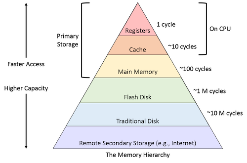

Modern C++ has, to some important degree, moved away from the Gang of Four style of programming found in the famous 1994 book ***Design Patterns: Elements of Reusable Object-Oriented Software***. This style relied heavily on object-oriented programming, dynamic polymorphism, and reference semantics. This style of programming incurs performance hits due to the overhead produced by virtual functions, the cost of creating small polymorphic objects, and the indirection of accessing data within complex schemes. But its utilization not only costs us in runtime performance, but also tends to be the source of many bugs. Let's look at an example to better understand why.

### Reference Semantics
```C++
void print(std::span<int> s) {
    std::cout << " (";
    for (int i : s) {
        std::cout << ' ' << i;
    }
    std::cout << " )\n";
}

int main() {
    std::vector<int> v{1,2,3,4};

    std::vector<int> const w{v};
    std::span<int> const s{v};
}
```
We have our vector, a const vector copied from the first one, and a const span. What can we do with these?
```C++
int main() {
    std::vector<int> v{1,2,3,4};

    std::vector<int> const w{v};
    std::span<int> const s{v};

    w[2] = 99; // Compiler error!
    
    s[2] = 99; // All good, s is a reference to v and as long as we do not change that, we can modify its elements

    print(s); // 1,2,99,4
}
```
A span is an abstraction over an array that falls into the reference semantics philosophy realm of C++. It typically holds a pointer to the first element and stores the size of the array it points to. That is why we can modify the span even though it's marked const. This already receives a bad mark for confusion since we ideally want our objects marked const to be more readily understood as not modifiable. If we really want our span to restrict modification of its elements, we need to:
```C++
std::span<const int> const s{v};
```
Later on in our program, we attempt to do what we did above again:
```C++
    v = {5,6,7,8,9};
    s[2] = 99;
    print(s); // 1,2,99,4
```
We expect this will print 5,6,99,8,9, but to our surprise, it actually prints 1,2,99,4. But why? The answer is reference semantics! When we reassigned new values to `v`, we actually assigned five values instead of four, which means the vector must have reallocated new memory for itself to accommodate the extra values. But `s` still points to the original memory address `v` initially had because `s` is essentially a reference to that value. The end result is the dreaded undefined behavior where we are reading values from memory we do not want to read from. Theoretically, anything could be at that memory address, and no one can be certain what will happen once we read from it. The ideal scenario here is probably a program crash.

Let's consider a second example:
```C++
    std::vector<int> vec {1,-3,27,42,4,-8,22,42,37,4,18,9};

    auto const pos = std::max_element(vec.begin(), vec.end());

    vec.erase( std::remove( vec.begin(), vec.end(), *pos), vec.end());
```
The goal here is to find the greatest value in our `vec` and remove all occurrences of it. In this case, the largest value is 42, and it occurs twice in the vector. The second line is used to find the largest value (42) and returns us an iterator to that value (reference semantics). Next, we call `std::remove` on that iterator, which will take the value at that iterator and move it to the end of the vector and return an iterator to the new end of the vector (size - number of elements moved to the back). Finally, we call `erase` on the vector, which will truly delete all elements from the iterator given by `remove` to the end of the vector. The results are not as we would expect:
```C++
    {1,-3,27,-8,22,42,37,4,18,9};
```
There is still a 42, and we are now missing a 4! This is because what we actually did was pass a reference to a position in our `std::remove` function, which told the algorithm to remove the element at that position. After we moved the first 42 to the back of the vector, the next element at that position was the 4, which it dutifully removed next. The only way to get the proper behavior is:
```C++
     std::vector<int> vec {1,-3,27,42,4,-8,22,42,37,4,18,9};

    auto const pos = std::max_element(vec.begin(), vec.end());
    auto const val = *pos;

    vec.erase( std::remove( vec.begin(), vec.end(), val), vec.end());
```

### Value Semantics
Value semantics solves a lot of the confusion and unexpected behavior that comes with the use of pointers and references. In C++, reference semantics is a necessary part of life, but modern C++ engineers should always look to use value semantics where possible. By value semantics, we mean the usage of deep copies to ensure all containers and objects own their resources without fear that they can be modified elsewhere. When we have a vector, instead of passing its contents to a span, which references the first memory address of that same vector, we should often look to copy elements to another vector, which will make a full deep copy of the elements.
```C++
    std::vector<int> v{1,2,3,4};

    std::vector<int>  w{v};
```
Here, `w` has its own copy of the elements, and any changes made will not impact `v`. The initial concern here and the hesitation to move away from reference semantics is performance concerns. Consider our `print` function again:
```C++
void print(std::vector<int> s) {
    std::cout << " (";
    for (int i : s) {
        std::cout << ' ' << i;
    }
    std::cout << " )\n";
}

int main() {
    std::vector<int> v{1,2,3,4};

    std::vector<int>  w{v};
    print(w);
}
```
Unlike what we saw earlier, where we passed a span to `print`, we are now asking for a new vector called `s` to be allocated memory and filled to match `w`. This, on its face, will be significantly more expensive than our span example that passes a single encapsulated pointer and size variable. This is often the case, and a good developer should take note of this. A great example is passing non-owning string views to functions in order to avoid very expensive string copies from scope to scope.

But there are often ways to mitigate value semantics runtime penalties that come with passing data around. Copy elision and move semantics are two important tricks utilized to avoid expensive copies. On the other hand, value semantics will often lead to much more efficient sub-routines. The reasons for this include:

1) **Less indirection.** Using virtual functions and pointers requires the program to access a random memory address on the free store. Accessing memory outside of the local CPU cache can often starve the processor of things to do for a long period of time while that data is fetched.


Obviously, read times will be different for different machines, but as a general rule of thumb:
* L0 & L1 Cache - 0.5 to 5 nanoseconds
* L2 Cache - 5 to 7 nanoseconds
* L3 Cache - 10 to 40 nanoseconds
* L4 Cache - 40 nanoseconds
* Main Memory - 60 nanoseconds
* Disk Storage - 100 to 300 nanoseconds
When we speak of reading from heap memory, that often means reading from main memory or disk storage. This is many magnitudes slower than reading from memory in a cache near the CPU. Avoiding pointer reads from heap memory will often improve runtime performance and is a massive reason to reach for value semantics. 

2) **Slow read times are not our only problem with performance hits tied to reference semantics.** Another issue is that the indirection caused by reference semantics prevents the compiler from optimizing. During compilation, the C++ compiler will review your code and look for opportunities to optimize what is written for better runtime performance. But this is only possible to the extent it can safely understand what the program is meant to do. Reference semantics and other runtime polymorphism prevent the compiler from optimizing code that it otherwise would have. 

### Conclusion
One of the things I love about C++ is the diverse and expressive toolset it provides. The real-world problems engineers often need to solve cannot always fit into clean, pre-made solutions but require unique approaches to solve well. C++ provides lots of reference and value semantic tools to help us solve different problems in different ways. Reference semantics has a massive role to play in C++ programs. Even though I gave examples above about the dangers of `std::span`, it is still a very useful

 tool that I have used in multiple programs with success. 

But modern C++ encourages us to turn to value semantics wherever possible. Copying and moving resources around in modern C++ is cheaper than it ever has been, and compilers are getting better at optimizing and simplifying this code. So go ahead and copy that data!

