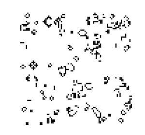
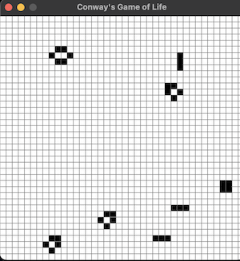

The Game of Life, also known as Conway's Game of Life or simply Life, is a cellular automaton simulation devised by the British mathematician John Horton Conway in 1970. The game is played on a grid of square cells, where each cell is either alive or dead. The cells interact with their eight neighbors, which are the cells that are adjacent to them horizontally, vertically, or diagonally. The rules for Conway's Game of Life are:

1) Birth: A dead cell becomes alive if it has exactly three live neighbors.
2) Death by isolation: A live cell dies if it has one or fewer live neighbors.
3) Death by overcrowding: A live cell dies if it has four or more live neighbors.
4) Survival: A live cell survives if it has two or three live neighbors.

I recently set out to build the Game of Life myself [link](/projects/rust-game-of-life/). Thanks to the simplicity of the game, it only took me about an hour to get the program up and running in Rust. But despite the lack of complexity to the program, there are massive epistemological implications to the game I would like to flesh out a little more. 

Back in undergraduate school, I began reading a lot of Ludwig Von Mises and Friedrick Hayek, both economists from the Austrian school of thinking. What fascinated me about these two was how much they leveraged the epistemological constraints of human intellect into their economic frameworks. They argued that human knowledge was not only practically limited, but also fundamentally limited in ways that had massive implications for economic science. Things like the [socialist calculation problem](https://en.wikipedia.org/wiki/Socialist_calculation_debate) arose from this framework arguing the knowledge needed to centrally plan resource allocation was outside the grasp of all of us. Any attempt to centrally plan the economy would require using shortcut informational heuristics to guess about the best allocation or resources that would likely result in misallocation, shortages, and poverty. Instead, the only real option available for efficient economic allocation is to allow for the free exchange of goods and resources between individuals and allow for the corresponding coordinatation that would come through the prices these exchanges naturally produced. In summary, the answer to the best allocation of resources can't be predicted, and is only known afterwards as we let things play out. 

Back in 2013, I came across a [paper](https://cdn.mises.org/qjae16_2_5.pdf) written by Lucas Engelhardt that investigates the claim that, although humans might not have the cognitive capacity to centrally control the allocation of resources, maybe computers can. Computers, after all, are kind of magical. They tend to do things magnitudes of orders faster than us. The macbook m1 I am typing this post up on can run at 3.2 GHz, which is approximately 3.2 billion computations per second. Math problems that would take me minutes with pen and paper to resolve can be solved by computers is microseconds. The speed and capacity of computers to take in massive amounts of data and process them appears ripe as a tool for central planning. Yet accoding to Engelhardt, even assuming away most of the challenges of economic planning and the computing involved in managing this planning, it takes computers way too long. With massive unrealistic assumptions to simplify the problem, it would take the worlds top 500 supercomputers (working together) 2.6 million years to manage just 100 different economic goods amongst the population of the United States. Probably not practical.

At the time, this was surprising to me given my lack of understanding on the topic, and of computers in general. But it sent me down a long rabbit hole into a very rich field of research involving epistemology and computing. I began reading about [the halting problem](https://en.wikipedia.org/wiki/Halting_problem) and [Godel's incompleteness theorem](https://en.wikipedia.org/wiki/Gödel%27s_incompleteness_theorems). I to this day continue to struggle to map to my mental model of the world that there exists no formal system that is itself sufficient without the help of an outside axiom to work. ***Turing's Cathedral: The Origins of the Digital Universe*** by George Dyson does a really good job of documenting the wave of insights that occured the first half of the 20th century that brought many of these insights. It is a read I highly recommend. This all brings us back to the Game of Life and why it is so interesting. 

The Game of Life has a very few simple rules. And yet, given a starting configuration of black and white squares, it is impossible to systematically predict the final outcome, or if there will even be a final outcome. For example, the only way to know what will happen with this starting configuratino is to actual run the game:

This is a strange claim, but stick with me. The great Stephen Wolfram speaks to this often, he calls it computational irreducibility. Wolfram argues that there are lots of things that are computationally reducible. What he means by this is there are algorithms / shorcuts that allow us to predict the outcome of certain events without having to simulate each step of the process. Dropping a baseball off a 10 story building is such an example. We have shortcuts equations such as this

For a projectile launched with an initial velocity \( v_0 \) at an angle \( \theta \):

1. **Horizontal position**: $$
   x(t) = v_0 \cos(\theta) t
   $$

2. **Vertical position**:
   $$
   y(t) = v_0 \sin(\theta) t - \frac{1}{2} g t^2
   $$

3. **Time of flight**:
   $$
   T = \frac{2 v_0 \sin(\theta)}{g}
   $$

4. **Maximum height**:
   $$
   H = \frac{(v_0 \sin(\theta))^2}{2g}
   $$

5. **Range**:
   $$
   R = \frac{v_0^2 \sin(2\theta)}{g}
   $$

We can use these equations to know when the ball will hit the ground without having to sit and actually watch the ball fall to see the end result. This was great news for the Apollo 11 astronauts who upon being flung out into space were probably very relieved to find that the moon was exactly where our equations said it would be. We have millions of examples like this where we have found ways to understand the world using shortcut equations and rules. But other things do not appear to lend way to such reducibility. The Game of Life falls into this category, it suffers from the same constraints as the halting problem. 

The halting problem was first formulated by Alan Turing in 1936. It addresses whether it is possible to create an algorithm that can determine, for any arbitrary program and input, whether the program will eventually halt (finish execution) or run forever. He concluded that some problems cannot be solved by algorithm using the proof:

1) Assume such an algorithm exists.
2) Use H to construct a program P′ that contradicts its own behavior
3) If H predicts P′ will halt, P ′enters an infinite loop.
4) If H predicts P′ will not halt, P′ halts.
5) This contradiction shows H cannot exist.

We cannot predict, prior to running the Game of Life program, if the starting configuration will ever fall into a stable state where nothing new happens or if new configurations will continue indefinitely. Now this does not mean we can't predict the outcome of some specific configurations at start. We obviously can predict how a configuration that is one black square in the center of the board will finish. Instead, what we mean is that there is no algorithm that allows us to take any and all arbitrary starting configurations and predict the outcome. 

For example, this initial starting configuration:

produced this outcome at the second time step:

It was only after about 10 minutes of running the game that the board reached a configuration where nothing new would occur

This configuration was made of shapes that either did nothing new or would rotate between two shapes indefinitely. For an easier example of what I mean, takethis shape:

which will always result in this shape:

which will always turn back into the previous shape:

and this will continue for as long as we run the program. This is generally referred to as a stable configuration in the game similar to a program halting. My initial configuration above similarly resulted in a stable configuration, but this was not something I knew would happen prior to running the program, partially because there is no general equation or algorithm that could have predicted this outcome prior to running the simulation.

The conclusion of all this is rather unintuitive. The Game of Life is deterministic and simple, yet fully outside our ability to predict prior to running the simulation. It posits a hard limit to the predictability and knowledge we can obtain about certain parts of our universe. Similar to what God said to the sea in Job 38:11, He tell us our knowledge of the universe can come this far, but no further. The implications of this extend far outside of the Game of Life. There are things inscrutable to human cognition. Epistemic humility is a requirement to having a better model of our world. For fans of science fiction, Netflix's The Three Body Problem tackles this very topic focusing on the computational irreducibility of knowing how three large bodies in space will precisely interaction with each other and how a planets orbit will be influenced by these interactions after a certain period of time. Things we intuitively think would be possible to accomplish, particularly with our advancements in computing, end up being too difficult to ever know.

Outside of predicting how a computer program will execute or if an alien planet will experience inclement weather, the lessons of computational irreducibility / epistemic humility have lots of implications for our moral and political philosophies as well. Arguments for and against tax cuts that regularly accompany the American politic fail to take into account the immense number of variables at stake in an a large economy such as ours. All these variables similarly make predicting the outcome of any tax policy impossible. The fact that a tax cut was followed by a recession is far from proof that tax cuts do not work as a catalyst to economic growth. Utilitarianism also famously suffers from the reducibility problem. How any action might contribute to producing the greatest good for the greatest number (whatever that might even mean) is beyond our ability to know. Much like the Game of Life, it is only by watching the consequences of our actions play out in real time that we can begin to understand its utility and if it was actually a moral action. Not of much help for those of us who, as of yet, do not possess time machines. Even worse, we cannot predict when the consequences of our actions will halt (in this scenario when our action will no longer have any impact on general utility) which means we might need to observe the consequences for our actions into the infinite future prior to knowing if it was a moral action. 

We, of course, are not without tools in our belt to understand and make predictions about future states of computationally irreducible problems. Praxeology tells us that, everything else being equal, tax cuts will produce economic prosperity[^1]. We cannot predict if a tax cut will produce any increase in GDP or decrease in poverty rates, but the knowledge praxeology provides is nonetheless a helpful guide for our actions. Likewise for utilitarianism, looking back at past actions and their consequences to date give us an inference to how similar actions will impact societal utility in the future. Weather prediction is technically a problem of computation irreducibility, and yet we get relatively accurate forcasts week after week due to simplified models that can give us probabalistic outcomes (70% chance of rain tomorow). In some cases, it is incumbent upon us to become more bayesian, in other areas more deontological. Parsing out when to be which is something we all must come to work on, but it must start with coming to grips with our epistemic limitations. 

Conway's Game of Life is a fun demonstration of the nature of our reality. Our technological progress over the past 100 years has given many a false sense of confidence in our abilities. In some ways, I think humans are wired with a false sense of confidence in our ability to conquer and subdue the world around us, if not now in some ways, then in the near future for sure. This may be a major contributor to how we have acheived as much as we have as a species. But in pursuit of truth and a better model of the universe, the Game of Life introduces road closed signs on potential paths we can take. I recommend we heed the message these signs provide and plan our paths accordingly.

Footnotes
[^1]: Economic prosperity is narrowly defined here to mean individuals will be able to acheive their own ends more easily the lower taxation rates are. This comes about as more capital is made available to invest in lengthening production and allowing for fewer inputs to be needed to acheive the same amount of outputs. Theoretically, a society could become poorer but still this could be called prosperity if this aligns with the desires of people, for example a society that rather sit around on the beach in little huts most of their day may give up many luxuries we consider a part of economic growth. 