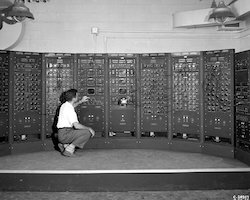
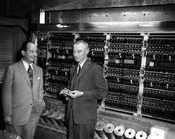
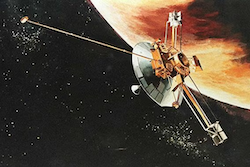

*The great technological achievement of the 20th century was building digital computers to replace their clunky analog counterparts. The great achievement of the 21st century will be using those digital computers to simulate the analog devices they had replaced.*
 
 

In the basement of Fuld Hall at the Institute for Advanced Study in 1951, the birth of the digital universe 
was taking place. Led by John von Neumann and inspired by Allen Turing's 1936 paper [On Computable Numbers](https://www.cs.virginia.edu/~robins/Turing_Paper_1936.pdf)[^1], a new digital computer was being built. Using nearly 17,000 6J6 vacuum tubes, the IAS machine was amongst the first to usher in a new era of computing. At the time, analog reigned supreme in the world of technology, powering everything from radios and television to devices designed to calculate rocket trajectories. 

  

 
[The Analog Computing Machine](https://www.space.com/25571-analog-computing-machine-in-fuel-systems-building.html) - Used for fuel systems analysis

  

As prevelent and useful as these devices were, they were very limiting. An analog device could only perform the specific task its hardware was configured to do. An analog radio could convert radio waves into sound. An analog calculator could perform limited mathematical computations. If you needed these devices to do something new, you would need to physically modify the device itself. In contrast, the new breed of digital computers were different. These devices, like the IAS computer, could execute any arbitrary set of instructions given to them. These instructions, which came to be known as programs or software, could be quickly loaded into the computer's memory, changing the behavior of the device at will. If a task could be broken down into small incremental steps, the digital computer could do it. Unlike its analog computer cohort, which were rigidly built for specific tasks, these new digital devices were true universal Turing machines capable of simulating any computable sequence. They didn't specialize, but instead were generalists. 

Proof of their capability was on display by the summer of 1952 at Princeton where the IAS computer would spend its daylight hours computing hydrogen bomb calculations and its nights simulating evolution, weather patterns, and anything else scientists could think of.

  

[The Digital Computing Machine](https://www.ias.edu/electronic-computer-project) - Robert Oppenheimer (right) with John von Neumann in front of the Electronic Computer Project’s ENIAC machine, ca. 1952.

  

The flexibility and speed of digital devices offered vast superiority over analog and quickly brought about the digital revolution. The birth of this digital universe was accompanied by the birth of a new sense of inspiration and hope for the future. These devices would unlock the universe and enable us to do anything we could imagine, or so we thought.

Digital and analog are two terms thrown around frequently, but what exactly do they mean? The difference between the two can be narrowed down to how the information they work with is represented. Digital data is represented as a binary set of 1's and 0's. There is a high level of precision that makes up digital data. In the digital world, a seven will always be 00000111. No ambiguity exists about what this set of binary values represents. Analog, on the other hand, is not represented as discrete values but instead as continuous values that often use ranges to handle categorical information. Consider the following example of both an analog and digital system for counting people entering a room:

*Digital* - as a person enters a room, they cross a turnstile that releases one ping pong ball into a bucket. At the end of the day, we can count how many ping pong balls are in the bucket to know how many users entered the room. Each ping pong ball is a discrete representation of the data we are considering.

*Analog* - as a person enters a room, they cross a turnstile that pours a gallon of water into a large bucket. The bucket has lines drawn on it marking the fill line per gallon. Some of the water getting poured into the bucket can splash out during the pour process, and there is an unpredictable amount of evaporation that can occur throughout the day. To account for this imprecision, when counting the number of people who enter the room, unless the amount perfectly sits at a certain fill line, we consider the next number above the surpassed fill line to be our final count. For example, if the water was somewhere between the 10-gallon and 11-gallon fill line (say 10.42 gallons), we declare the final count to be 11 individuals who entered the room. The water is a continuous representation of the data we are considering.

The analog counting system seems like a strange choice for counting users entering a room compared to the digital system, and perhaps it is, but it does have its advantages. Compared to the analog system, the digital system is not well prepared to handle a malfunction of any kind. If a ping pong ball bounces out of the bucket it is added to, our count will now be off. The discrete nature of the data a digital system manages means any small error cannot easily be accounted for. The analog system, on the other hand, can handle a significant amount of errors without impacting outcomes due to its non-discrete way of handling data. Evaporation, water splashing out, even a small leak in the container will likely not influence the final count unless the malfunction can impact more than a gallon of water.

While analog systems possessed certain advantages, digital systems rapidly gained dominance starting in the 1950s, and for valid reasons. The discrete handling of data allowed digital systems to receive and execute any arbitrary set of precise instructions. The digital system was a generalist capable of handling many diferent kinds of tasks such as calculating rocket trajectories, playing music, and simulating other digital systems. One machine that could do it all. Additionally, the ease of copying and communicating discrete data between different digital systems opened up new avenues of functionality that otherwise would have been very difficult to accomplish. For instance, the binary representation of 00000111 consistently denotes the number 7 across various digital platforms, facilitating swift and reliable data exchange between them. The rise of the internet capitalizes on these advantages. Unlike pre-internet times when software had to be purchased physically and uploaded onto individual machines via physical input/output methods, the internet allows for instantaneous delivery of software from servers to users' web browsers on demand. Despite the inefficiency of relying on large servers to load and transfer software across the globe via internet cables over and over again, the convenience of accessing any desired software by simply entering a web address into a browser proved too good to not use. Moreover, the discrete nature of digital data ensures reliable transmission of precise software instructions from servers to a users' browser, instilling confidence that a users' computers will execute act as intended. The antiquated analog devices of old never stood a chance.

Digital computers feel like magic to most of us. Things that would take us humans a long time to complete can be done almost instantaneously on a digital device. Your computer tirelessly executes billions of instructions every second of every day in ways that is hard for us to comprehend. This magic was not lost on the pioneers of the digital computer who envisioned a future where these devices eventually would rival and surpass human intellect itself. Self-driving cars, robots to do household chores, artificial intelligences that would tackle an array of problems were all right around the corner. In the summer of 1956, the now famous Dartmouth College summit on artificial intelligence took place. Ten scientists that would later be recognized as founding figures of the field submitted the following proposal to the Rockefeller Foundation: 

*"We propose that a 2-month, 10-man study of artificial intelligence be carried out during the summer of 1956 at Dartmouth College in Hanover, New Hampshire. The study is to proceed on
the basis of the conjecture that every aspect of learning or any other feature of intelligence can in
principle be so precisely described that a machine can be made to simulate it. An attempt will be
made to and how to make machines use language, form abstractions and concepts, solve kinds of
problems now reserved for humans, and improve themselves. We think that a significant advance
can be made in one or more of these problems if a carefully selected group of scientists work on it
together for a summer."* [^2] 

These leading figures thought that over the course of a single summer, artificial intelligence could begin to come to fruition! What followed over the next five decades was a bitter pill of humility about our understanding of intelligence and the ease of replicating it in our digital systems. 

Between 1956 and 2006, computers became exponentially more powerful, nearly doubling in power every two years, and yet something was amiss. In some areas, we leveraged the growing power of digital devices to advance science, manage company finances, predict weather patterns, and play the latest cat videos on Youtube. But other tasks remained outside of our reach. Things even the humble housefly could accomplish, such as navigating the family living room, remained challenging for our most advanced computers and robots. Building software to engage in conversation with people likewise struggled to reach any sort of useful maturity. Algorithms were developed over time to handle both these kinds of tasks, but they only worked in limited and controlled environments and were prone to breaking outside of those scopes. The enthusiasm and momentum first generated by artificial intelligence specialists back in 1956 began to dissapate as reality set in. The digital revolution, for all its progress and optimism, was stuck on many of the things that seemed to come so naturally to humans. The adulations that accompanied the unveiling of Honda's robot Asimo in the early 2000s was confirmation of the problems we faced. After 50 years of work, we had barely been able to get a robot to climb a set of [stairs](https://www.youtube.com/watch?v=VTlV0Y5yAww), a task many two-year-old children do without thinking.

The problem we faced with building intelligent digital systems was the nature of the system itself. The discrete way of digital computers made them fast and flexible in that they could execute any arbitrary set of instructions given to them. But these instructions need to be absurdly precise which makes the system brittle when they need to act in the messy real world. The failure of AI in the latter half of the 20th century was the failure of the GOFAI (Good Old-Fashioned Artificial Intelligence) approach. Programming digital systems traditionally involves the implementation of logic/rules based systems. Many in the first few generations of engineers thought this was sufficient for building intelligent machines. Simply have the machine engage in high-level symbol manipulation then stand back and marvel. They were wrong.

Imagine an engineer working on his companies self-driving car team, tasked with developing an algorithm to detect trees in the car's path. This task holds significance as a fundamental safety measure, ensuring the vehicle doesn't collide with obstacles. Initially, the task might appear straightforward to the engineer. Surely, one can outline precise steps to analyze the car's camera feed and spot any trees present. But how? Digital systems operate on strict rules, necessitating a clear definition of what constitutes a tree. If an object in the image possesses certain characteristics, it is labeled as a tree. This set of characteristics resembles a defintion of the thing we are trying to categorize. But as simple as the task seems at first glance, there is a problem. Regardless of the definition crafted, it inevitably falls short: either too narrow, excluding relevant instances, or too broad, encompassing irrelevant ones. This problem harks back to the philosophical inquiry that inspired Plato's concept of the forms —abstract ideals that reality can only imperfectly imitate [^3]. The engineer may first try to have the algorithm look for something with leaves. But what is leaf? Each tree has leaves of differents shapes and colors. Are the pine needles on some trees going to be accounted for in your definition of a leaf? In reality, this approach only pushed our categorical problem down to a another level. Also, did the engineer take into account deciduous trees that spend half the year without any leaves at all? Even once we move past the leaves approach, a multitude of others problems arise. What about the shadow of a tree? We need to ensure our algorithm isnt broad enough to include those. Especially because a shadow will possess almost all the characteristcs of the tree itself but we certainly dont want our car swerving to avoid shadows. The complexity of the task quickly cascades and underscores a broader truth: the real world's complexity exceeds the capacity of traditional, rigid digital frameworks to deal with.

The problem is perplexing. Our engineer drives to his job every day easily avoiding things he classifies as trees along the way, but then struggles to lay out the steps for how he does it once he gets to the office. Why is it that a 16-year-old can swiftly master driving, while our most advanced supercomputers struggle even after decades of refinement? The crux lies in the intricate analog nature of the human brain. Comprising billions of computing units known as neurons, our brains operate through the exchange of electrical signals. Each neuron possesses a threshold, firing only when the cumulative electrical inputs exceed it. When we observe a tree, myriad neurons engage in a collective "voting" process, considering diverse factors like colors, shapes, and contextual cues (e.g., whether the setting resembles the surface of the moon, a significant heuristic indicating the absence of a tree). Once a critical mass of neuronal signals aligns in favor of identifying the object as a tree, our conscious recognition follows suit. This cognitive mechanism lacks precision; throughout the day, numerous neurons may signal incorrectly, yet these instances often go unnoticed due to their minority status. Despite its apparent complexity, this messy neural voting process proves remarkably adept at navigating the intricacies of our noisy world.

A great example of our analog brains at work with a classification task can be found in the famous Supreme Court case Jacobellis v. Ohio, where Justice Potter Stewart, when asked to define obscene pornographic content remarked:

*"I shall not today attempt further to define the kinds of material I understand to be embraced within that shorthand description ["hard-core pornography"], and perhaps I could never succeed in intelligibly doing so. But I know it when I see it, and the motion picture involved in this case is not that."* [^4]

There is something so fundamentally human about not being able to define something but to intuitively *know it when we see it*. We operate this way every day of our lives. There's a deeply human aspect to our ability to recognize something without being able to neatly define it—a skill we employ daily. Unlike the digital system discussed earlier, which required precise criteria to identify a tree, humans effortlessly perform this task, often without articulating a clear definition of what a tree is. Our brains, leveraging its analog nature, possess a remarkable ability to unlock this power. A power we have, to date, not been able to embed in our digital technology.

The analog nature of our brains offers numerous other advantages over our digital counterparts as well. Despite weighing in at only three pounds and consuming the equivalent power of a refrigerator's lightbulb, our brains make trillions of computations per second, unlocking all the capabilities we take for granted. This combination of power and efficiency is essential for mobile mammals that often go extended periods without food. In contrast, modern digital computers, capable of approaching our brain's computational power, require vast spaces in server farms and energy consumption comparable to entire city blocks. This distinction underscores the one of the major trade-offs between analog and digital systems. While digital devices are generalists, designed to prioritize a specific kind of versatility (being able to reliably execute any set of arbitrary instructions given to it), our brains function differently. Unlike Hollywoods portrayal in movies like the Matrix, we cannot simply "upload" a generic program into each persons brain and have it work. We cannot upload a set of rules that govern how to identify a tree and expect the human brain to be able to logically execute that set of rules during an identification task. The neurons in each persons head are intricately wired for specific functions and work as a collective to process non-discrete data in a way that is unique to each individual. Our neurons are specialists, not generalists. 

Another crucial advantage analog brains possess is that they demonstrate remarkable resilience to malfunctions. While digital systems can catastrophically fail from even minor disruptions, our brains handle occasional misfirings of neurons with relative inconsequence. 

Starting in November of 2023, the Voyager 1 space probe at nearly 15 billion miles away from earth, began communicating back giberish that NASA stuggled to understand [^5]. 

 

  The Voyager 1 space probe was launched in 1977 and left our solar system in August of 2012

  

The communication was a repeating pattern of 1's and 0's that appeared to be stuck in a loop. This cosmic communcation breakdown threatens to end the mission since without coherent data being sent back from the probe, no more science can take place. While the reason for this malfunction has yet to be determined, it has been suggested that a stray cosmic partcile may have flipped a single bit in the computers memory from 0 to 1, or 1 to 0. The fact that such a small, seemingly innoculous, malfunction as one digit in memory getting changed can bring down an entire system demonstrates just how rigid these digital systems are. Unlike a digital system, where altering a single bit fundamentally changes data interpretation, a misfiring neuron in our brain doesn't cause us to pee our pants and forget our name for an hour. Instead, it's akin to a little bit of water spillage in our aformentioned analog counting system—insignificant in its impact.

Of course, the analog nature of our brains comes with some disadvantages as well. Learning requires physical rewiring of neurons which is a slow and messy process. Furthermore, there is no simple way to transfer information from one person to another. The neural networks that make up our brains handle information in a distinct way from everyone else's and there is no easy way to map information from one person's brain to the next. Instead, we are forced to use inefficient methods to transfer information such as spoken human language. Verbally explaining something to someone is slow and messy. My understanding of the sentence "take care of the dog" may be very different from the person making the statement. Does that mean feed it? Walk it? Take it to the vet because it's sick? The ambiguity of human natural language requires adding lots of context in order to come in alignment between two or more people on the information that is being conveyed. This extra context is time consuming to convey. In the time it takes for someone to explain to me what they mean by "take care of the dog", two digital computers can transfer entire gigabytes worth of books, text, and knowledge back and forth. And because the data is digital, there is no ambiguity on what each packet of information means. The "knowledge" on one device will perfectly match the "knowledge" on the other device. The digital nature of data and its incredible precision means less context is needed and transfer between two or more devices is efficient. I found this talk on the differences between digital and analog communication to be really insightful [^6].

What does all this mean for building intelligent systems to automate driving cars and fold our laundry? Are we doomed with rigid digital systems that will never acheive the level of functionality we want? Was the digital revoltuion a mistake? 

The answer to this problem is the reincorporation of analog back into our technology. Recent advances in artificial intelligence have done exactly this. Software like ChatGPT and Tesla's self-driving cars have embraced the power of analog as a way to build intelligent systems. A software program called the artificial neural network[^6] was the key.

While artificial neural networks aren't a new concept, they've significantly advanced in the past decade, propelled by increased computational power and the availability of vast training data. These software algorithms loosely mimic the workings of the human brain, comprising large networks of simulated neurons that adaptively wire themselves to perform specific tasks. Similar to our biological neurons, these simulated counterparts exchange signals and collectively "vote" to determine outcomes, mirroring the brain's analog decision-making process. No longer are rigid rules needed to guide digital functionality. Through a process of training these artificial neural networks, messy concepts can be comprehended and generalizable rules of action in uncontrollable enviornments can be learned. 

What sets this technology apart is its ability to simulate analog systems within digital frameworks, offering the advantages of both paradigms. Digital systems, renowned for their agility in modifying instruction sets, enable rapid learning in artificial neural networks. Moreover, these digital systems, designed to process information akin to analog devices, excel in navigating complex and uncontrolled environments like driving on roads. The neural network running in a Tesla may have never seen a coyote in the middle of the road, but even without strict well-defined rules on what to do, the system can generalize a good strategy for the scenario. Having digital systems that simulate analog systems has another advantage as well: replication. Once a digital device trains its neural network effectively for driving, the system can be effortlessly replicated and deployed across numerous other vehicles, instantly endowing them with identical capabilities.

The future embraces irony. We discarded analog devices as an antiquated technology of the past only to use the digital devices we replaced them with to bring them back. The resurrection of our past technologies will be the primer to a new era of technology. ChatGPT and other similar artificial intelligence technologies are not going away. Their significance is yet to be fully comprehended, but it is unlikely their impact on the 21st century can be overstated.

Footnotes
[^1]: https://www.cs.virginia.edu/~robins/Turing_Paper_1936.pdf
[^2]: http://jmc.stanford.edu/articles/dartmouth/dartmouth.pdf
[^3]: https://iep.utm.edu/republic/
[^4]: https://firstamendment.mtsu.edu/article/potter-stewart/#:~:text=Stewart%20concluded%20that%20criminal%20obscenity,succeed%20in%20intelligibly%20doing%20so.
[^5]: https://www.youtube.com/watch?v=rGgGOccMEiY
[^6]:https://www.scientificamerican.com/article/nasa-restores-communications-with-ailing-voyager-1-spacecraft/#:~:text=One%20possibility%20was%20that%20a,hostile%20wilds%20of%20interstellar%20space.
[^7]: https://www.ibm.com/topics/neural-networks