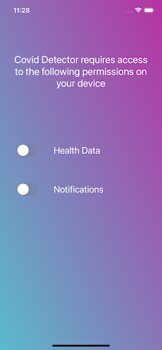
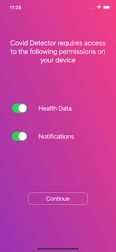
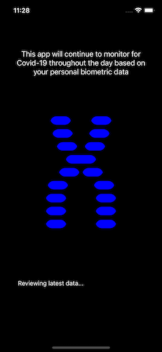
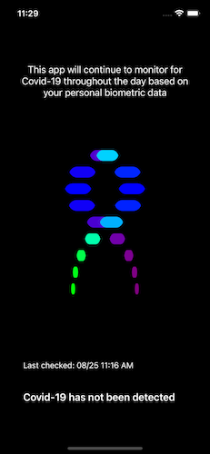
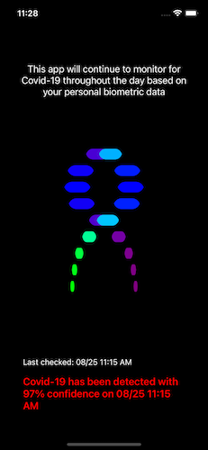
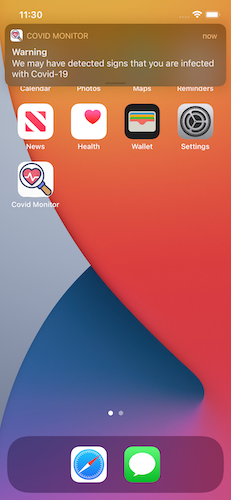

An iOS app that monitors for Covid-19 using an Apple Watch

This app utilizes Sp02 and Pulse data recorded by an Apple Watch Series 6 and machine learning to monitor for Covid-19. Documentation on how I built this model can be found here: https://github.com/crweaver225/Covid-Diagnostics/blob/main/proposal.pdf

Even when not being used, the app will periodically run in the background and monitor for signs that the user has become infected with Covid-19. The app will notifiy the user if it determines with high probability that the user might have contracted the virus. 

Covid Monitor first requires the user give permission to access their health data recorded by their Apple Watch. The app also asks for permission to send alerts to the user if Covid-19 is ever detected.

The app will constantly monitor for Covid-19 by taking a users vital signs and running them through machine learning models trained specifically for this task.   

A message appears at the bottom helping keep you informed of any Covid-19 detection

The app will also run when not in use and send you an alert if it thinks you might have Covid-19

A video demo of the app can be found here: https://youtu.be/FoL-Q-pcomY

A demo of the app notifying a user it has detected Covid-19 can be found here: https://youtu.be/oH9bZr6CKjA