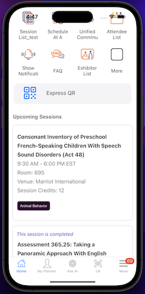
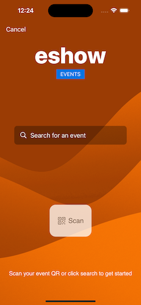
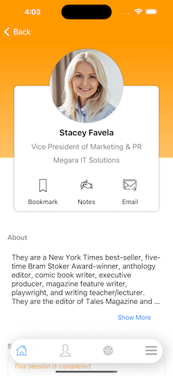
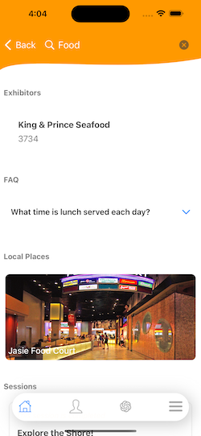
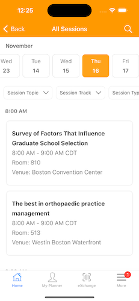

## Intro
The eShow mobile conference app is a native iOS app used at large conferences, tradeshows, and events. Downloaded by those attending, the app helps users throughout the conference. Crafting an agenda, reviewing offered sessions, navigating exhibitor halls, networking with others attendees, and more. The app was built with an eye towards scalability and customizability for event managers contracting with eShow to provide a mobile app for their event. The app provides powerful features, beautiful interfances, and intuitive usage. 

## Contributions
The app was primarily developed by myself starting in the winter of 2021 with contributions from other iOS developers. 

## Features
- Vibrant and cusotmizable home pages with big sponsorship opportunities, easy navigation access, a global search engine, and helpful widgets (upcoming sessions, recent show feed posts, etc)

- Offline supremacy. This app needed to function in the darkest corners of a conference center where internet is often lacking. We delivered, ensuring almost every part of the app functions without a network. Even our global search engine works entirely offline, providing users with a powerful search feature at all times. 

## Usage
- eShow provides a QR code that when distributed to attendees, can be scanned to download the app from the App Store. Once downloaded the same QR code can be used to find their event and load it up. once loaded, the app keeps the user logged into that show until the event is over. 